### Nginx

#### 安装

~~~javascript
系统 centos 7

iptables -F ---关闭
iptables -t nat -F ---关闭

必须环境：
yum -y install gcc gcc-c++ autoconf pcre pcre-devel make automake
yum -y install wget httpd-tools vim

在该路径下创建 /etc/yum.repos.d/nginx.repo 后添加如下

[nginx-stable]
name=nginx stable repo
baseurl=http://nginx.org/packages/centos/$releasever/$basearch/
gpgcheck=1
enabled=1
gpgkey=https://nginx.org/keys/nginx_signing.key

[nginx-mainline]
name=nginx mainline repo
baseurl=http://nginx.org/packages/mainline/centos/$releasever/$basearch/
gpgcheck=1
enabled=0
gpgkey=https://nginx.org/keys/nginx_signing.key

完成上述后
yum install nginx ---即可完成最新稳定版安装

使用 nginx -v 查看是否安装成功

rpm -ql nginx ---查看安装的路径
~~~

#### 命令：

systemctl restart nginx.service	---重启nginx

systemctl reload nginx.service	---重新加载nginx.conf 配置文件

##### nginx 命令

- nginx -s reload ---重新加载配置文件
- nginx -t ---检测配置文件是否有错
- nginx -c 路径 ---选择加载那个配置文件

##### nginx.conf

###### 正则匹配

~~~javascript
location ~ .*\.(jpg|gif|png)$ {
    ....
}

~ :代表模糊匹配
*\.(jpg|gif|png)$ :代表匹配所有以jpg,gif,png结尾的请求

locaiton ~ ^/download {
	....
}

^/download :代表第二级为download的请求 比如：www.xxx.com/download/xxx
~~~

#### 模块：

##### 查看Nginx客户端状态

- with-http_stub_status_module	---Nginx的客户端状态

  - 开启：配置文件server location 中加入 stub_status 即可

  - ~~~javascript
    server {
        location /mystatus {
            stub_status;
        }
    }
    ~~~

##### 替换页面中某些值

~~~javascript
location / {
    sub_filter '需要替换的页面参数 如: <a>mytest' '替换的参数 如: <a>MYTEST';
    sub_filter_once off; ---是否全部替换 如果未 off代表全部替换 默认为on
}
~~~

##### 请求限制 连接限制

~~~javascript
# 连接限制 $binanry_remote_addr 代表当前访问的客户端ip
# 连接限制 zone=conn_zone 一个名称 用于其他地方使用 如下 location中事例 1m 代表大小
limit_conn_zone $binanry_remote_addr zone=conn_zone:1m;

# 请求限制 rate=1r/s 代表一秒中只能请求一次
limit_req_zone $binanry_remote_addr zone=req_zone:1m rate=1r/s;

server {
    listen       80;
    server_name  localhost;

    location / {
        # 代表静态文件路径 可以放在server下 代表所有的location 都会在server下的root下访问
        root   /usr/share/nginx/html;
        # 首页名称 默认访问路径
        index  index.html index.htm;

        # 同一时刻 只允许一个ip 进入
        # limit_conn conn_zone 1;
        # 请求根据上方写的规则 zone=req_zone 1秒中只有一次请求 
        # burst=3 ：被阻塞的三个请求放在下一秒执行 
        # nodelay 其余请求 返回 503
        # limit_req zone=req_zone burst=3 nodelay;
        # limit_req zone=req_zone burst=3;
        # limit_req zone=req_zone;

    }

}

~~~

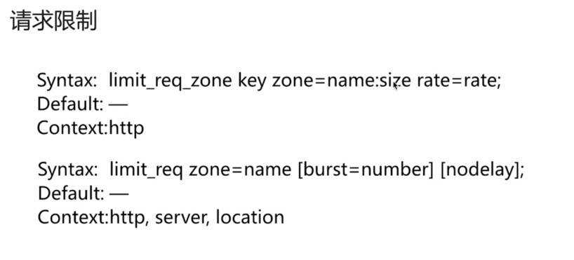

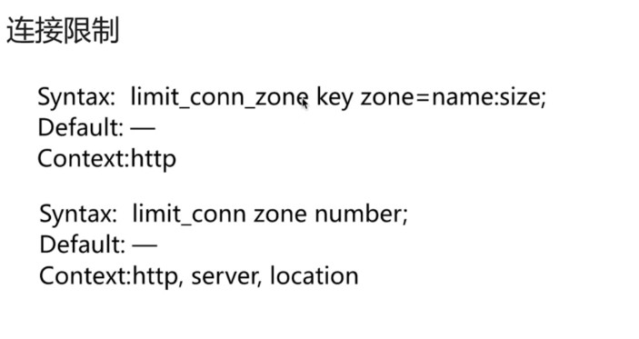

请求限制 更加细粒度

##### 访问控制

~~~json
    location /access {
        root   /usr/share/nginx/html;
        index  index.html index.htm;

        #访问控制 allow 可以作为访问控制 只有信任的ip才能访问等
        # 常规方式为 allow定义为 all ，deny 定义那些不能访问
        
        allow 192.168.1.101 #代表那些可以进行访问
        deny all #代表那些不能进行访问 all代表所有

        #上述两者结合 代表 192.168.1.101 这个ip之外所有的连接都不能访问(特殊情况除外 骇客除外)

    }
~~~

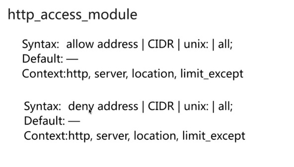

###### 局限性

如图：

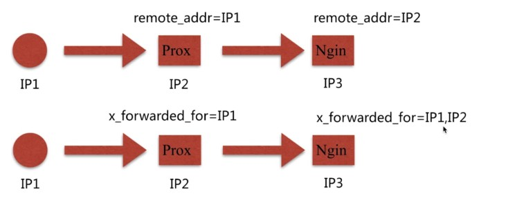

access_module 模块使用的为 remote_addr 变量作为控制，但是该变量作为控制，传递到后端的实则为中间件的ip地址，不是用户原有的ip地址 ，所以访问控制 可能不准确。

而使用 http_x_forwarded_for 可以当作一种解决方法，但是是不安全的，x_forwarded_for 为http所带的头信息，会一级一级的把ip带上，形成一个类似数组的形式，但是 头信息在浏览器中是可以进行修改的，所以是否为真实的ip，也是一个问题。

其余方法：

- 结合geo模块
- 通过http自定义变量传递

##### 登陆控制

模拟：

- 第一步 使用 htpasswd -c 路径 用户名称 密码

- 第二步 在对应的 locaiton 中 加入配置

  - ~~~javascript
        location / {
    
        	auth_basic "my password";	#名称
    
        	auth_basic_user_file /etc/nginx/mypasswd;	#存放密码文件的路径
    
        }
    
    ~~~

局限性：

- 需要手动往文件中进行添加，且多个之间，联动需要进行很多额外的操作。

方案：

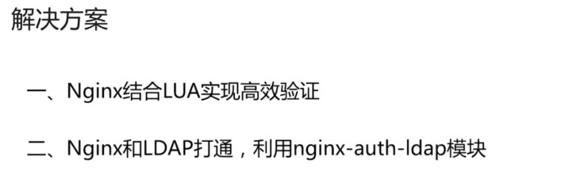

#### 静态资源Web

##### gzip压缩

~~~javascript
server {
    listen       80;
    server_name  112.74.46.153 mytest.com;

    access_log  /var/log/nginx/host.access.log  main;

    location ~ .*\.(jpg|gif|png)$ {
        #开启gzip 压缩
        gzip on;
        #http 版本
        gzip_http_version 1.1;
        #压缩级别 越低越高 占用的服务端性能越高
        gzip_comp_level 2;
        #压缩类型
        gzip_types text/plain application/javascript application/x-javascript text/css application/xml text/javascript application/x-httpd-php image/jpeg image/gif image/png;

        root   /mylib/my/images;

    }

    location ~ .*\.(txt|xml)$ {
        gzip on;
        gzip_http_version 1.1;
        gzip_comp_level 2;
        gzip_types text/plain application/javascript application/x-javascript text/css application/xml text/javascript application/x-httpd-php image/jpeg image/gif image/png;

        root /mylib/my/mytxt;
    }

    error_page   500 502 503 504  /50x.html;
    location = /50x.html {
        root   /usr/share/nginx/html;
    }

}

~~~

##### 设置缓存时间

~~~javascript
    location ~ .*\.(html|htm)$ {
        #设置缓存时间
        expires 24h;
        root  /usr/share/nginx/html;
    }
~~~

##### 设置跨站访问

~~~javascript
    location ~ .*\.(html|htm)$ {
        #后面的网站 表示该站点允许跨站 如果设置*号代表所有
        add_header Access-Control-Allow-Origin http://www.mytest.com;
        #访问类型
        add_header Access-Control-Allow-Methods GET,POST,PUT,DELETE,OPTIONS;
        root  /usr/share/nginx/html;
    }
~~~

##### 静态资源下载

~~~javascript
    location ~ .*\.(html|htm)$ {
        #先打成gzip格式进行存放
        gzip_static on;
        #提高网络包传输效率
        tcp_nopush on;
        root  ....;
    }
~~~

##### 防盗链(静止某些访问)

原理：使用 http-referers 信息查看从和请求过来的，如果是自身信任的请求过来的，放行。比如从百度搜索而来，这种请求放行，如果未不信任的请求过来，不放行。

~~~java
     location ~ .*\.(jpg|gif|png)$ {
        gzip on;
        gzip_http_version 1.1;
        gzip_comp_level 2;
        gzip_types text/plain application/javascript application/x-javascript text/css application/xml text/javascript application/x-httpd-php image/jpeg image/gif image/png;
		
         #none ---代表没有带referer 信息过来的请求
         #blocked ---表示访问的请求 不是标准的 http:// 的请求
         #112.74.46.153 ---表示只允许 112.74.46.153 该ip的请求
             #注意事项 该表达式 可以模糊匹配 比如 在后加上 ~/baidu\./google 等
             	#valid_referers none blocked 112.74.46.153 ~/baidu\./google\.;
         valid_referers none blocked 112.74.46.153;
         
         
         
         # $invalid_referer ---实则为上的值 该变量即上值 if判断 如果为0 返回403 非0 正常返回
         if($invalid_referer) {
             return 403;
         }
         
        root   /mylib/my/images;

    }
~~~

#### 代理服务

##### 反向代理，正向代理

~~~javascript
locaiton / {
    proxy_pass http://location:8080 #某个网址 
}

反向代理：代理服务端
	类似把服务端的内部请求 禁止外界访问，然后通过nginx 代理本地 外界的访问通过反向代理 访问内部的资源，如上所示，外界的请求/，实则传递给了http://location:8080 对于内部资源而言，其实是本地访问
	
正向代理：代理客户端
	代理客户端的某些，比如翻墙 使用就是正向代理，把客户端的ip进行代理 使用某个代理ip进行操作.
	
	
代理时 常用的配置
location / {
	#代理后通往的地址
    proxy_pass http://location:8080;
    #代理的重定向 一般为默认
    proxy_redirect default;
    
    #自定义的头信息 拿到host信息
    proxy_set_header Host $http_host
    #自定义的头信息 拿到ip地址
    proxy_set_header X-Real_IP $remote_addr
    
    #设置tcp超时 时间
    proxy_connect_timeout 30;
    #设置 发送连接时间
    proxy_send_timeout 60;
    #设置 接收连接时间
    proxy_read_timeout 60;
    
    #设置 缓存头信息大小
    proxy_buffer_size 32k;
    #开启
    proxy_buffering on;
    #设置 缓存大小 因为一开始缓存与内存中 如果内存满了 则存放于硬盘中
    proxy_buffers 4 128k;
    proxy_busy_buffers_size 256k;
    proxy_max_temp_file_size 256k;
}
~~~

#### 负载均衡

~~~javascript
客户端的nginx 配置
upstream [name] {
    server xxx.xx.xxx.xxx:8080;
    server xxx.xx.xxx.xxx:8081;
    server xxx.xx.xxx.xxx:8082;
}

server {
    listen 80;
    server_name location;
    
    location / {
        proxy_pass xxx.xx.xxx.xxx;
        include proxy_params; #这里指的是通用参数，参考上述代理时常用配置
    }
}

上述代表nginx 为这三台服务 开启了负载均衡，默认采用的时轮询算法，即每个服务从上至下依次访问。

 
注意事项:
	-- 作用域在 http 下

服务端内部的xx.cnof

server {
    listen 8080;
    server_name locaiton;
    
    location / {
        root ...;
        index index.html;
    }
}
~~~

##### upstream的一些配置

~~~javascript
一个基础的upstream
upstream myup {
    server liaoyichao.top weight=5;
    server myliao.com:8080;
    server unix:/tmp/backend;
    
    server xxx.com:8080 backup;
    server xxx.com:8080 backup;
}

解释：上述有三台用于负载均衡的服务器 两台备用的服务器

weight：该值越大，被连接的可能性越大
	nginx默认为轮询算法，但很多时候不是使用轮询算法，应该服务器的性能可能不一，所以使用 weight = 数值 的方式，指定那些服务器更加优先连接，因为其承载量更高。
    
backup：当连接都不可用的时候，启用备用服务器

location / {
    #设置 error 错误的时候 访问
    proxy_next_upstream error timeout invalid_header http_500 http_502 http_503 http_504;
    
    
    表示当发生如上错误的时候，切换到下一台访问.
    timeout ---超时
    invalid_header ---不正常的头信息
}
~~~

内部的一些参数：

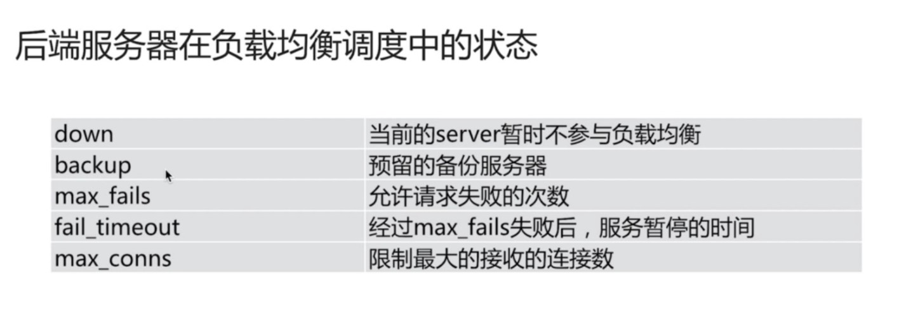

###### 均衡算法其余策略

nginx默认为轮询。

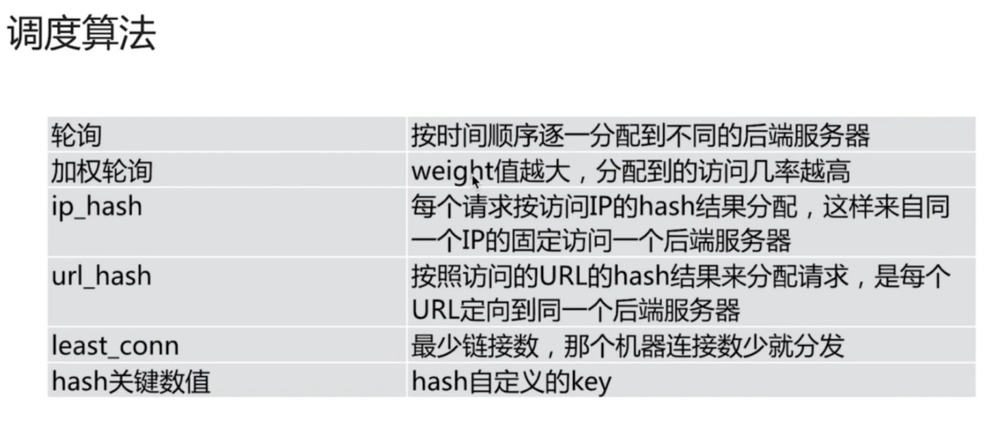

开启方式：

~~~javascript
upstream myup {
    ip_hash;	#即代表开启 ip_hash 策略
    ......
}
    
如上类似：url_hash 和 least_conn 同样如此开启

最后的 hash 关键数值 ---为自定义
    如：hash $request_url ---代表网址后的所有参数
    	即：xxx.com/后面的所有参数
    正常使用不会只是一个 $request_url 因为后面很多时候是带参数的，所以大多时候，使用正则进行某些匹配后进行 hash
~~~

#### 缓存设置

~~~javascript
http 作用域中

http {
proxy_cache_path /xx/xx levels=1:2 keys_zone=my_cache:10m max_size=5g inactive=60m use_temp_path=off;
}

#proxy_cache_path /xx/xx ---表示缓存存放位置
#levels=1:2 ---表示缓存的目录设置 这里表示两层目录进行分级
#keys_zone=my_cache:10m ---zone空间的名称，并设置该空间的大小
#max_size=5g ---该缓存目录最大多少 如果达到最大值，会自动触发nginx淘汰机制，较少访问的缓存会被清除
#inactive=60m ---如果该缓存被有在定义的时间中被访问，会被清除
#use_temp_path=off ---临时文件存放 off代表关闭，因为如果开启，会和缓存目录可能有冲突.

location / {
    proxy_cache my_cache; #这里定义的为上述的 keys_zone 空间的名称
    proxy_cache_valid 200 304 12h; #返回码为200 和 304 的缓存 过期时间为 12h
    proxy_cache_valid any 10m; #表示除了200 和 304的缓存为 10分钟过期
    proxy_cache_key $host$url$args; #缓存的key
}
~~~

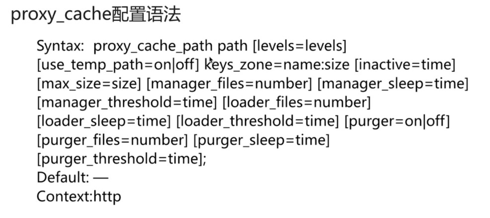

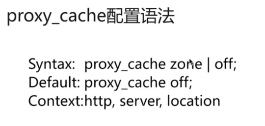

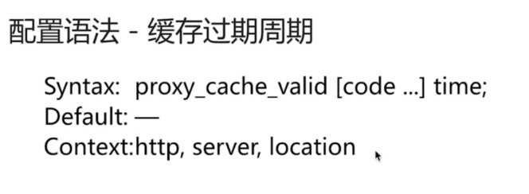

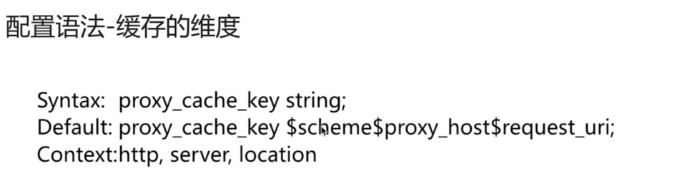

##### 清除指定缓存

需要使用到 第三方扩展包

ngx_cache_purge

##### 指定那些不缓存

proxy_no_cache \$arg_comment ....;

~~~java
可以使用变量的方式：如下所示

if($request_url ~ ^/(login|password)) {
	set $mycache 1;
}

location / {
	proxy_no_cache $mycache;
}

当访问的url中出现 /login or /password 的时候，不会进行缓存.

~~~

#### 学习途中遇见的坑：

1. nginx.conf 中的user 设置 最高权限为 root 如果发现出现403错误 很多时候是因为该用户不是root 导致.

