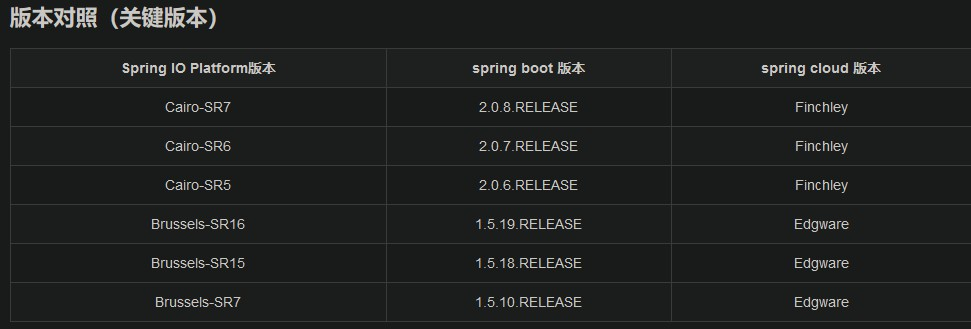
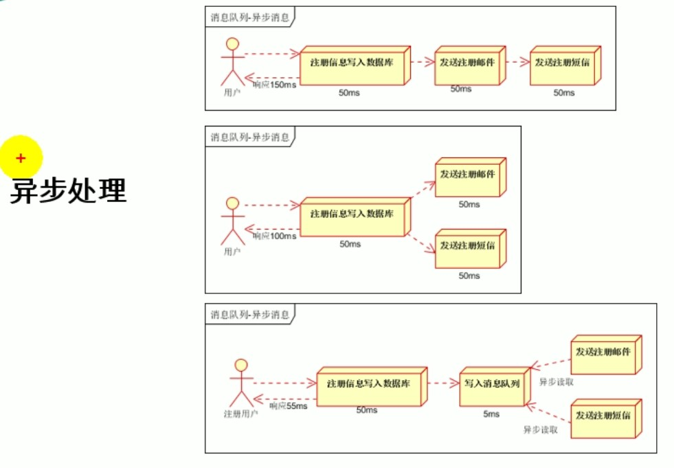
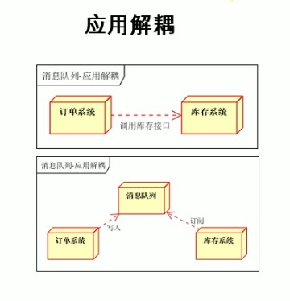
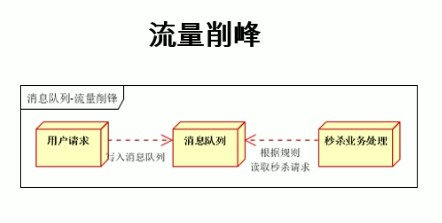
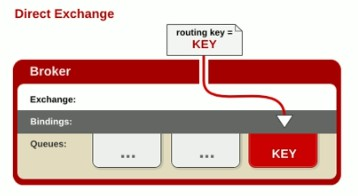
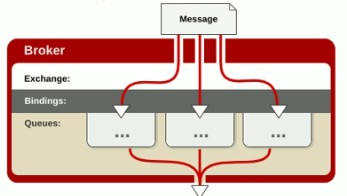
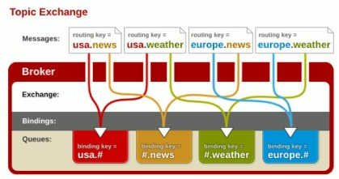
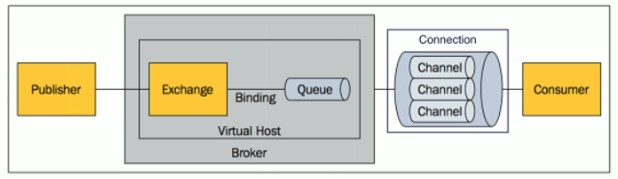
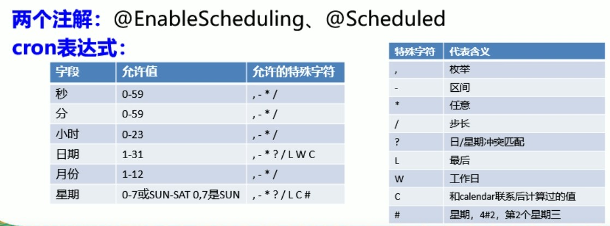

### SpringBoot


#### Spring Pom

使用 Spring io 和 Spring cloud dependencies 进行版本管理 (如下所示 SpringBoot版本 1.5.6 and SpringCloud Edgware)

```java
    <dependencyManagement>
        <dependencies>
            <dependency>
                <groupId>io.spring.platform</groupId>
                <artifactId>platform-bom</artifactId>
                <version>Brussels-SR4</version>
                <type>pom</type>
                <scope>import</scope>
            </dependency>
            <dependency>
                <groupId>org.springframework.cloud</groupId>
                <artifactId>spring-cloud-dependencies</artifactId>
                <version>Edgware.RELEASE</version>
                <type>pom</type>
                <scope>import</scope>
            </dependency>
        </dependencies>
    </dependencyManagement>
```




#### Spring 注解：

##### RESTful 风格

```java
@GetMapping("/user/{id:\\d+}")

	--- 在url中可以填写正则表达式 进行校验 如上该url需要传入一个 id 并且用正则规定为一个整数。
```


##### @RequestParam

```java
    @GetMapping("/user")
    public List<User> query(@RequestParam(name = "",defaultValue = "",required = false) String userName){
    }

	@RequestParm(name=“”,defaultValue="",required="" String userName)
	name: 指定一个名称 该名称会映射到 后面的参数名 userName上
	defaultValue: 设定一个默认值
	required: 是否一定需要传参，当设置为false的时候，可以不传参，为true，必须传参，默认true
```


##### @PageableDefault

```java
@PageableDefault(page = 2,sort = "age ASC",size = 15) Pageable pageable
	--- 设置默认值
```


##### @JsonView

```java
	根据自身需求显示某些Bean字段
	
entity 事例：

@Data
public class User {

    public interface UserSimpleInterface{};

    public interface UserComplexInterface extends UserSimpleInterface{};

    @JsonView(UserSimpleInterface.class)
    private String userName;

    @JsonView(UserComplexInterface.class)
    private Integer age;
}

controller 事例：
	
	//使用JsonView 返回结果 userName字段 age字段并没有
    @GetMapping("/user")
    @JsonView(User.UserSimpleInterface.class)
    public List<User> query(User user, @PageableDefault(page = 2,sort = "age ASC",size = 15) Pageable pageable){

        System.out.println(ReflectionToStringBuilder.toString(user, ToStringStyle.MULTI_LINE_STYLE));

        List<User> list = new ArrayList<User>();
        list.add(new User());
        list.add(new User());
        list.add(new User());

        return list;
    }

	//返回userName 和 age字段 因为entity中为继承 接口会继承功能
    @GetMapping("/user/{id:\\d+}")
    @JsonView(User.UserComplexInterface.class)
    public User queryOne(@PathVariable Integer id){

        User user = new User();
        user.setAge(id);
        user.setUserName("张三");
        return user;

    }
```


#### Spring 单元测试

##### SpringBoot 测试用例

```java
package top.liaoyichao.web;

import org.junit.Before;
import org.junit.Test;
import org.junit.runner.RunWith;
import org.springframework.beans.factory.annotation.Autowired;
import org.springframework.boot.test.context.SpringBootTest;
import org.springframework.http.MediaType;
import org.springframework.test.context.junit4.SpringRunner;
import org.springframework.test.web.servlet.MockMvc;
import org.springframework.test.web.servlet.request.MockMvcRequestBuilders;
import org.springframework.test.web.servlet.result.MockMvcResultMatchers;
import org.springframework.test.web.servlet.setup.MockMvcBuilders;
import org.springframework.web.context.WebApplicationContext;

/**
 * @Author: LiaoYiChao
 * @Date: 2019/4/19 23:30
 * @Description: User Controller Test
 */
@SpringBootTest
@RunWith(SpringRunner.class)
public class UserControllerTest {

    private MockMvc mockMvc;

    @Autowired
    WebApplicationContext wac;


    @Before
    public void set(){
        mockMvc = MockMvcBuilders.webAppContextSetup(wac).build();
    }


    @Test
    public void queryUser() throws Exception{

        mockMvc.perform(MockMvcRequestBuilders.get("/user")
                .contentType(MediaType.APPLICATION_JSON_UTF8))
                .andExpect(MockMvcResultMatchers.status().isOk())
                .andExpect(MockMvcResultMatchers.jsonPath("$.length()").value(3));
								//表达式 json-path 具体请Github 搜索json-path 查看
    }
}

```


#### Spring Cache

概念  and  缓存注解

| 名称           | 作用                                                         |
| -------------- | ------------------------------------------------------------ |
| Cache          | 缓存接口，定义缓存操作(如：RedisCache)                       |
| CacheManager   | 缓存管理器，管理各种缓存组件(比如是使用redis缓存还是其他缓存) |
| @Cacheable     | 针对方法配置，能根据方法的请求参数对其结果进行缓存           |
| @CacheEvict    | 清空缓存                                                     |
| @CachePut      | 保证方法被调用，又希望结果被缓存                             |
| @EnableCaching | 开启基于注解的缓存                                           |
| keyGenerator   | 缓存数据时Key生成策略                                        |
| serialize      | 缓存数据时value序列化策略                                    |
| @Caching       | 指定多规则（代表伤处Cacheable，CachePut等）                  |


##### @Cacheable()

- cacheName/value：指定缓存组件的名字 把方法的返回值进行缓存 是一个数组的方式，可以指定多个缓存


- condition：缓存条件 比如 #id > 0 当传入的id参数值 大于0 的时候才进行缓存


- untess：功能类似上 但是条件如果为true 则不进行缓存 通常是判断结果是否为null，如果未null 则不缓存 untess = "#result == null"


- sync：是否使用异步模式（如果使用异步 就不能使用untess）


- key：缓存数据使用的key：默认时使用方法参数的值
  - 该key可以使用SpEL表达式 如下所示

~~~java
@Cacheable(value = "findByIdUser" , key = "#id" condition = "#id > 0")
public User findById(Integer id){
    
}

//上述注解中的 #id 的含义时取出传入的参数值当作key
名称			概述					使用方法
methodName	当前被调用的方法名		#root.methodName
method		当前被调用的方法		#root.method.name
target		当前被调用的目标对象		#root.target
targetClass	当前被调用的目标对象类		#root.targetClass
args		当前被调用的参数列表		#root.args[0]	---代表第一个参数
result		当前方法执行后的返回值		#result
#xx			当前方法参数名				如上所示#id
~~~


##### @CachePut

​	--- 既调用方法 也更新缓存 常用于更新操作 内部和@Cacheable类似

​	如果想要同步更新缓存中的数据 需要加上 key 且该key要和该数据之前缓存的时候key

~~~java
@CachePut(value="testCache" , key = "#user.id")
public User updateUser(User user){
    
}
~~~


##### @CacheEvict

​	---清除缓存

​	--- allEntries = true 清除该缓存中所有的数据 即该value名称中所有的缓存数据

​	--- beforeInvocation = false  是否在方法前清空缓存 默认false(方法之后执行)

​		如果为true 会在方法执行之前执行，无论方法是否出现异常 都会清空缓存

~~~java
@CacheEvict(value = "deleteUser" , key = "#id")
public User deleteUser(Integer id){
    //删除时按照指定key进行删除
}
~~~


##### @Caching

~~~java
@Caching(
    cacheable = {
        @Cacheable(value="",key="")
    },
    put = {
        @CachePut(value="",key=""),
        @CachePut(value="",key="")
    }
)

//该注解内部可以有多个
~~~


##### @CacheCofig

​	--- 公共抽取 一般在类上标注

​		比如：该类下的缓存都属于 xxx组中

~~~java
@CacheConfig(value = "emp")
public class test{
    //该类的所有缓存都会默认在emp组下
}
~~~


注意事项：

​	@CachePut

​		每次的结果都会被缓存 常用于更新操作


#### Spring AMQP

AMQP：消息队列，常应用于异步处理，应用解耦，流量削峰等

异步处理：



服务解耦:



流量削峰:



##### RabbitMQ

简述：由erlang开发的AMQP

###### 概念：

- Message

  - 消息，由消息头和消息体组成。消息体是不透明(消息内容)，消息头是一系列可选属性，如routing-key(路由键)，priority(消息优先权)，delivery-mode(消息是否持久化)等

- Publisher

  - 消息生产者，即外界发送到服务器的消息

- Exchange

  - 交换机，用于接收生产者发送的消息并将该消息发送到对应的消息队列中

    - direct(默认) ---点对点 只有交换机Key 和 路由键Key 完全一致的时候才进行发送

      

    - fanout ---发布订阅式 只要于该类型的交换机进行绑定，都会被发送消息

      

    - topic ---发布订阅式 有规定的发布订阅式，类似正则 #.msg ，*.msg 。# 代表一个单词，\* 代表一个或多个单词

      

- Queue

  - 消息队列，用于保存消息直到发送给消费者。消息会一直存储在队列中，直到被取走。一个消息可以投入一个或多个队列中

- Binding

  - 绑定，用于消息队列和交换机之间的关联。一个绑定就是基于路由键将交换机和消息队列连接起来的路由规则，两者之间可以多对多(交换机 和 消息队列)

- Connection

  - TCP连接

- Channel

  - 信号，建立在TCP连接内的虚拟连接。之所以使用信道，为节省系统开支，信道为复用一条TCP连接

- Consumer

  - 消息消费者

- Virtual Host

  - 虚拟主机




###### 使用方法：

配置：

~~~java
pom导入 ---springboot
        <dependency>
            <groupId>org.springframework.boot</groupId>
            <artifactId>spring-boot-starter-amqp</artifactId>
        </dependency>
~~~


application.yml

```java
spring:
  rabbitmq:
    host: 112.74.46.153
    username: guest
    password: guest
#   virtual-host ---虚拟主机名称
    virtual-host: /
    port: 5672
        
        

```

代码：

~~~java
    //RabbitTemplate 发送消息 and 接收消息
	@Autowired
    RabbitTemplate rabbitTemplate;
	
	//AmqpAdmin  定义交换机，消息队列，绑定关系
    @Autowired
    AmqpAdmin amqpAdmin;


    /**
     * 发送消息
     */
    @Test
    public void setMesagger() {
        //Message需要自己构建，定义消息体内容和消息头 exchange--交换机 routingKey--路由键
        //rabbitTemplate.send(String exchange, String routingKey, Message message);

        Map<String,Object> map = new ConcurrentHashMap<>();
        map.put("msg","MyUser_Test");
        map.put("data", Arrays.asList("Hello","World","I Love You",true));

        //发送一个Map消息到 交换机名称为:exchange.user 路由键为:myuser 的消息中间件上
        rabbitTemplate.convertAndSend("exchange.user","myuser",map);
    }


    /**
     * 接收消息
     */
    @Test
    public void getMessage(){
        Object o = rabbitTemplate.receiveAndConvert("myuser");
        System.out.println(o);
    }


    /**
     * 以代码的方式 设置消息队列，交换机，绑定关系
     */
    @Test
    public void setAmqp(){
        //创建一个交换机   new DirectExchange 创建一个Direct 类型的交换机
        amqpAdmin.declareExchange(new DirectExchange("exchange.my",true,false));

        //创建一个消息队列 String name ---消息队列名称, boolean durable ---是否持久化
        amqpAdmin.declareQueue(new Queue());

        /**
     	* 创建一个绑定规则 String destination ---目的地, 
     					Binding.DestinationType destinationType ---目的地类型(绑定消息队列还是交换机), 
     					String exchange ---交换机的名称, 
     					String routingKey ---路由键, 
     					Map<String, Object> arguments ---参数头信息
     	*/
        amqpAdmin.declareBinding(new Binding());

        //删除交换机
        amqpAdmin.deleteExchange();

        //删除消息队列
        amqpAdmin.deleteQueue();

    }
~~~


#### Spring 检索

##### ElasticSearch

一款使用REST ful风格的检索工具

###### 概述：

- 集群
  - 多个库在一起工作，类似Redis集群一般

- 索引
  - 索引好比Mysql中的数据库，在集群中，你要连入那个库中，就是索引的作用
- 类型
  - 类型就类似Mysql中的表，该索引下对应的类型，就好比该Mysql数据库下有那些表
- 文档
  - 文档就和Mysql中的一行数据一样。
- 属性
  - 好比Mysql中一个字段的名称

官方文档说明：[ElasticSearch](https://www.elastic.co/guide/cn/elasticsearch/guide/current/_search_lite.html)


###### 基础使用：

~~~Javascript
---------------------------------------
PUT /megacorp/employee/1
{
    "first_name" : "John",
    "last_name" :  "Smith",
    "age" :        25,
    "about" :      "I love to go rock climbing",
    "interests": [ "sports", "music" ]
}

发送一个put类型的请求 请求地址为/megacorp/employee/1 并附带发送User对象的JSON数据，该数据会保存到ElasticSearch中。
megacorp	---索引
employee	---类型
1			---特定ID
而文档就类似上述JSON中的数据 这是一行数据，也是一个文档
属性好比上JSON中的 first_name 这个就是一个属性.

当PUT请求成功后返回的JSON，状态码201：
{
    "_index": "megacorp",
    "_type": "employee",
    "_id": "4",
    "_version": 1,
    "result": "created",
    "_shards": {
        "total": 2,
        "successful": 1,
        "failed": 0
    },
    "created": true
}


---------------------------------------
GET /megacorp/employee/1
发送GET请求 就是读取该索引，该类型下，该ID中的数据

GET请求发送成功后数据返回，数据都在 _source 中,且每次PUT该数据成功一次，_version会 +1
{
    "_index": "megacorp",
    "_type": "employee",
    "_id": "1",
    "_version": 1,
    "found": true,
    "_source": {
        "first_name": "John",
        "last_name": "Smith",
        "age": 25,
        "about": "I love to go rock climbing",
        "interests": [
            "sports",
            "music"
        ]
    }
}


---------------------------------------
同理发送DELETE类型的请求 为删除文档
---------------------------------------
更新 只需要在此发送PUT请求即可
---------------------------------------

PUT类型	---新建和更新文档
GET类型	---获取文档数据
DELETE类型	---删除文档数据
~~~


###### **高级搜索**：

~~~Javascript
---------------------------------------
GET /megacorp/employee/_search

还是上述例子，但是最后为 _search 代表搜索该索引库，该类型下的所有数据 但一个搜索默认返回10条数据，其中数据放在hits中


---------------------------------------
URL方式条件搜索 属性 = 值
GET /megacorp/employee/_search?q=last_name:Smith

结果筛选，从上例子可知，_search 是查询所有，而后面带 ?q=last_name:Smith 的含义为返回 last_name 这个属性 = Smith 值的数据


---------------------------------------
JSON方式条件搜索 和上类似 属性 = 值
GET /megacorp/employee/_search
{
    "query" : {
        "match" : {
            "last_name" : "Smith"
        }
    }
}

同样发送查询所有的GET请求，但不同的是同时发送了一串JSON数据。
上述含义：在该结果文档中搜索last_name = Smith 的文档数据
query ---> 表示进行条件搜索，要在内部包上条件
match ---> 该属性中的数据即为条件搜索
last_name : smoth --> 属性 ：值


---------------------------------------
过滤搜索
GET /megacorp/employee/_search
{
    "query" : {
        "bool": {
            "must": {
                "match" : {
                    "last_name" : "smith" 
                }
            },
            "filter": {
                "range" : {
                    "age" : { "gt" : 30 } 
                }
            }
        }
    }
}

上述含义：搜索last_name = Smith 的同时 age > 30
range ---> 过滤器
gt ---> 表示大于(_great than)


---------------------------------------
GET /megacorp/employee/_search
{
    "query" : {
        "match" : {
            "about" : "rock climbing"
        }
    }
}

是不是感觉和上述一个例子类似，但是却有不同之处，就是实则match中的属性 和 值在ElasticSearch中为全文搜索（模糊匹配）的含义，ES会根据其中的值在该属性中进行相关单词匹配，比如 如下结果返回，可以清晰的看到 hits 中有两条数据，这两条数据中的 about 属性中 都有至少一个单词能匹配上，其中有个很重要的概念叫相关性得分，max_score，该分数越高代表匹配程度越高。

{
    "took": 7,
    "timed_out": false,
    "_shards": {
        "total": 5,
        "successful": 5,
        "skipped": 0,
        "failed": 0
    },
    "hits": {
        "total": 2,
        "max_score": 0.6189728,
        "hits": [
            {
                "_index": "megacorp",
                "_type": "employee",
                "_id": "2",
                "_score": 0.6189728,
                "_source": {
                    "first_name": "Jane",
                    "last_name": "Smith",
                    "age": 32,
                    "about": "I like to collect rock albums",
                    "interests": [
                        "music"
                    ]
                }
            },
            {
                "_index": "megacorp",
                "_type": "employee",
                "_id": "1",
                "_score": 0.26742277,
                "_source": {
                    "first_name": "John",
                    "last_name": "Smith",
                    "age": 25,
                    "about": "I love to go rock climbing",
                    "interests": [
                        "sports",
                        "music"
                    ]
                }
            }
        ]
    }
}


---------------------------------------
GET /megacorp/employee/_search
{
    "query" : {
        "match_phrase" : {
            "about" : "rock climbing"
        }
    }
}

当想要精确匹配的时候，只需要把 match ---> match_phrase 即可
这样就会把rock climbing 当作一个单词去查找 rockclimbing。


---------------------------------------
GET /megacorp/employee/_search
{
    "query" : {
        "match_phrase" : {
            "about" : "rock climbing"
        }
    },
    "highlight": {
        "fields" : {
            "about" : {}
        }
    }
}

搜索结果高亮：添加一个 highlight 字段，这里面的about属性被ES进行了HTML标签<em></em>封装

返回结果：
{
   ...
   "hits": {
      "total":      1,
      "max_score":  0.23013961,
      "hits": [
         {
            ...
            "_score":         0.23013961,
            "_source": {
               "first_name":  "John",
               "last_name":   "Smith",
               "age":         25,
               "about":       "I love to go rock climbing",
               "interests": [ "sports", "music" ]
            },
            "highlight": {
               "about": [
                  "I love to go <em>rock</em> <em>climbing</em>" 
               ]
            }
         }
      ]
   }
}

可以发现在 about属性中 被搜索的部分以HTLML的方式进行高亮处理


~~~


###### 属性含义：

~~~Javascript
PUT请求：
PUT /website/blog/123
{
  "title": "My first blog entry",
  "text":  "Just trying this out...",
  "date":  "2014/01/01"
}

当发送一个PUT请求到ES中时，如果没有出错，会返回
{
   "_index":    "website",
   "_type":     "blog",
   "_id":       "123",
   "_version":  1,
   "created":   true
}

~~~

- _index ：表示索引，即Mysql中的数据库名称

- _type：类型，即Mysql中的表

- _id：URL最后传入的 ID 

  - 如果不指定ID，即发送 POST /website/blog/ ，会自动生成一个ID 如

    - ```Javascript
      "_id":       "wM0OSFhDQXGZAWDf0-drSA",
      ```

- \_version：版本，每一次成功PUT该数据，_version会 +·1

- created：是否成功PUT


~~~javascript
GET请求：
GET /website/blog/123?pretty

返回结果：
{
  "_index" :   "website",
  "_type" :    "blog",
  "_id" :      "123",
  "_version" : 1,
  "found" :    true,
  "_source" :  {
      "title": "My first blog entry",
      "text":  "Just trying this out...",
      "date":  "2014/01/01"
  }
}

~~~

- pretty：美化输出
- found：GET请求成功返回true，不成功同样会返回JSON数据，但该属性为false
- _source：查询的数据


###### URL含义：

~~~javascript
------------------------------
GET /website/blog/123?_source=title,text
-->
_source=title,text	--->	检索文档部分结果.因为查询出来的结果都会存在 _source 属性中，所以在后添加条件查询这些属性，其余属性不会显示。

------------------------------
GET /website/blog/123/_source
_source	--->	查询所有

------------------------------
HEAD /website/blog/123
用HEAD类型发送请求，查询该文档是否存在

------------------------------
DELETE /website/blog/123

DELETE标记后，该文档不会立即从磁盘中删除，而是被标记为删除，ES会在之后添加更多索引的时候在后台进行内容的删除。
注意点：
发出删除请求后返回数据：_version 会+1
{
  "found" :    true,
  "_index" :   "website",
  "_type" :    "blog",
  "_id" :      "123",
  "_version" : 3
}
在此使用GET方式请求被删除的数据会返回如下结果
{
    "_index": "megacorp",
    "_type": "employee",
    "_id": "123",
    "found": false
}


重点：版本控制
***************************
PUT /website/blog/1?version=1
    
版本控制：如果在PUT请求后加上参数 version=1
    表示希望该文档中 _version 版本号为 1的时候进行更新操作。
	更新操作成功后，版本号会 +1
	当被更新的文档版本号不是 1 的时候，会返回404

	上述使用的为内部版本控制系统，当然还可以使用外部版本控制系统，很多时候ElasticSearch时作为搜索数据使用。
	外部版本控制系统使用：在主数据库中拥有类似 version 等可以用于版本控制的字段，在ES发送查询PUT请求的时候带上参数  version_type = version (必须为整数，大于0 < long类型(9.2e+18))
    
    比如：
    PUT /website/blog/2?version=5&version_type=external
    {
      "title": "My first external blog entry",
      "text":  "Starting to get the hang of this..."
    }
    
    表示版本号为5 版本字段为 external


~~~

ElasticSearch更多使用查看：

[ElasticSearch中文文档](https://es.xiaoleilu.com/030_Data/45_Partial_update.html)


###### Java中操作：

**JavaBean：**

~~~java
package top.liaoyichao.demo.entity;

import lombok.Data;
import lombok.experimental.Accessors;
import org.springframework.data.annotation.Id;
import org.springframework.data.elasticsearch.annotations.Document;

/**
 * @Author: LiaoYiChao
 * @Date: 2019/4/17 21:13
 * @Description: Book Bean Spring-Boot-ElasticSearch
 */
@Data
@Accessors(chain = true)
@Document(indexName = "my",type = "book")
public class Book {
	//@Document(indexName = "my",type = "book")
	//indexName:索引 type:类型
    @Id
    private Integer id;

    private String bookName;

    private String author;

}


package top.liaoyichao.demo.entity;

import io.searchbox.annotations.JestId;
import lombok.Data;
import lombok.experimental.Accessors;

/**
 * @Author: LiaoYiChao
 * @Date: 2019/4/17 19:54
 * @Description: Article(图书) Bean
 */
@Data
@Accessors(chain = true)
public class Article {
	
    //@JestId jest需要指名Id
    @JestId
    private Integer id;

    private String title;

    private String author;

    private String content;

}


~~~

**Repository：**

~~~java
package top.liaoyichao.demo.repository;

import org.springframework.data.elasticsearch.repository.ElasticsearchRepository;
import top.liaoyichao.demo.entity.Book;

/**
 * @Author: LiaoYiChao
 * @Date: 2019/4/17 21:14
 * @Description: Book ElasticSearch 基础操作方法
 */
public interface BookRepository extends ElasticsearchRepository<Book,Integer> {
}

~~~

**Test：**

~~~java
package top.liaoyichao.demo;

import io.searchbox.client.JestClient;
import io.searchbox.core.Index;
import io.searchbox.core.Search;
import io.searchbox.core.SearchResult;
import org.junit.Test;
import org.junit.runner.RunWith;
import org.springframework.beans.factory.annotation.Autowired;
import org.springframework.boot.test.context.SpringBootTest;
import org.springframework.test.context.junit4.SpringRunner;
import top.liaoyichao.demo.entity.Article;
import top.liaoyichao.demo.entity.Book;
import top.liaoyichao.demo.repository.BookRepository;

import java.io.IOException;

@RunWith(SpringRunner.class)
@SpringBootTest
public class ElasticsearchApplicationTests {

    @Autowired
    JestClient jestClient;

    @Autowired
    BookRepository bookRepository;

    /**
     * 传数据 使用 jest 操作
     */
    @Test
    public void set() {

        Article article = new Article();
        article.setId(1).setAuthor("lisi")
                .setTitle("头信息")
                .setContent("World");

        /**
         * 创建一个Index对象
         * .Builder() 传的参数 ---好比传入数据库的数据
         * .index() 索引 ---好比数据库
         * .type() 类型 ---表
         * .build() 构建索引
         */
        Index build = new Index.Builder(article).index("my")
                .type("article").build();

        try {
            jestClient.execute(build);
        } catch (IOException e) {
            e.printStackTrace();
        }
    }


    /**
     * 搜数据 jest 操作
     */
    @Test
    public void get(){


        String Json = "{\n" +
                "    \"query\" : {\n" +
                "        \"match_phrase\" : {\n" +
                "            \"title\" : \"头信息\"\n" +
                "        }\n" +
                "    }\n" +
                "}";
        Search build = new Search.Builder("Json")
                .addIndex("my")
                .addType("article").build();


        try {
            SearchResult execute = jestClient.execute(build);
            System.out.println(execute.getJsonString());
        } catch (IOException e) {
            e.printStackTrace();
        }

    }

    /**
     * 使用 spring-boot-starter-data-elasticsearch 进行操作
     * 注意事项：使用Spring-boot 操作 ES：5.x 版本的时候 需要格外注意版本号问题
     * 这里测试 使用Docker ES：2.4.6版本 SpringBoot版本为1.5.20
     * 而上述的Jest操作的版本为 ES：5.6.4版本 Jest版本为 5.3.3
     */
    @Test
    public void springBootSet(){

        Book book = new Book();
        book.setId(1).setBookName("三国演义").setAuthor("罗贯中");
    
        bookRepository.save(book);

    }


    @Test
    public void springBootGet(){

        Book one = bookRepository.findOne(1);
        System.out.println(one);

    }

}

~~~


##### Spring 异步任务

使用方法：

###### 异步任务：Service

~~~java
package top.liaoyichao.demo.service;

import org.springframework.scheduling.annotation.Async;
import org.springframework.stereotype.Service;

/**
 * @Author: LiaoYiChao
 * @Date: 2019/4/18 20:26
 * @Description: Async Service Demo
 */
@Service
public class AsyncService {

    @Async
    public void asyncTest(){

        try {
            Thread.sleep(2000);
        } catch (InterruptedException e) {
            e.printStackTrace();
        }

        System.out.println("处理 xxx 中");
    }
}

~~~


###### 异步任务：Controller

~~~java
package top.liaoyichao.demo.controller;

import org.springframework.beans.factory.annotation.Autowired;
import org.springframework.web.bind.annotation.GetMapping;
import org.springframework.web.bind.annotation.RestController;
import top.liaoyichao.demo.service.AsyncService;

/**
 * @Author: LiaoYiChao
 * @Date: 2019/4/18 20:27
 * @Description: Async Controller
 */
@RestController
public class AsyncController {

    @Autowired
    AsyncService asyncService;

    @GetMapping("/async")
    public String asyncTestController(){
        asyncService.asyncTest();
        return "Hello";
    }
}

~~~


###### 启动类：

~~~java
package top.liaoyichao.demo;

import org.springframework.boot.SpringApplication;
import org.springframework.boot.autoconfigure.SpringBootApplication;
import org.springframework.scheduling.annotation.EnableAsync;

@SpringBootApplication
@EnableAsync
public class TaskAsyncEmailScheduledApplication {

    public static void main(String[] args) {
        SpringApplication.run(TaskAsyncEmailScheduledApplication.class, args);
    }

}

~~~


###### 总结：

- 开启基于异步注解，在SpringBoot启动类上加上 @EnableAsync
- 在需要异步的方法上，加上 @Async


##### Spring 定时任务

###### Service

~~~java
package top.liaoyichao.demo.service;

import org.springframework.scheduling.annotation.Scheduled;
import org.springframework.stereotype.Service;

/**
 * @Author: LiaoYiChao
 * @Date: 2019/4/18 20:48
 * @Description: 定时任务实例
 */
@Service
public class ScheduledService {

    /**
     *  填写六个参数 * * * * * *
     *  第一个* :代表秒
     *  第二个* :代表分
     *  第三个* :代表时
     *  第四个* :代表日期
     *  第五个* :代表月份
     *  第六个* :代表星期
     */
    @Scheduled(cron = "0,1,2,3 * * * * *")
    public void helloScheduled(){
        System.out.println("Scheduled Hello");
    }
}

~~~


###### 启动类

~~~java
package top.liaoyichao.demo;

import org.springframework.boot.SpringApplication;
import org.springframework.boot.autoconfigure.SpringBootApplication;
import org.springframework.scheduling.annotation.EnableAsync;
import org.springframework.scheduling.annotation.EnableScheduling;

/**
 * @author Liao
 * 注解：@EnableScheduling 开启定时任务注解 @Scheduled
 */
@SpringBootApplication
@EnableScheduling
public class TaskAsyncEmailScheduledApplication {

    public static void main(String[] args) {
        SpringApplication.run(TaskAsyncEmailScheduledApplication.class, args);
    }

}
~~~


###### 总结：

- @Scheduled	---标注该注解的方法为定时方法，会定时执行该方法
- @EnableScheduling      ---开启注解定时任务
  - 需要在启动类上加上该注解，才能自动开始定时任务。




##### Spring 邮件任务

------ 以 136xxxxx82@qq.com 邮箱为例子

- 在邮箱设置中
  - 开启POP3/SMTP
  - 开启IMAP/SMTP
  - 生成授权码 第三方客户端登陆	

###### applicaiton.properties

~~~properties
spring.mail.username=1364446982@qq.com
#密码为授权码
spring.mail.password=cxvnpqzvbngifeaf
#表示为那种类型服务器 这里表示 QQ
spring.mail.host=smtp.qq.com
#开启安全的邮件传输
spring.mail.properties.mail.smtp.ssl.enable=true

~~~

###### pom.xml

~~~java
       <dependency>
            <groupId>org.springframework.boot</groupId>
            <artifactId>spring-boot-starter-mail</artifactId>
        </dependency>
~~~

###### java 操作

~~~java
package top.liaoyichao.demo;

import org.junit.Test;
import org.junit.runner.RunWith;
import org.springframework.beans.factory.annotation.Autowired;
import org.springframework.boot.test.context.SpringBootTest;
import org.springframework.mail.SimpleMailMessage;
import org.springframework.mail.javamail.JavaMailSenderImpl;
import org.springframework.test.context.junit4.SpringRunner;

@RunWith(SpringRunner.class)
@SpringBootTest
public class TaskAsyncEmailScheduledApplicationTests {

    @Autowired
    JavaMailSenderImpl mailSender;

    @Test
    public void contextLoads() {

        SimpleMailMessage message = new SimpleMailMessage();

        //设置标题
        message.setSubject("Hello");

        //设置内容
        message.setText("Ni Hao~");

        //设置由谁发送
        message.setFrom("1364446982@qq.com");

        //设置发送给谁（可以设置多个）
        message.setTo("liaoyichaoaime@163.com");

        mailSender.send(message);

/////////////////////////////////////////////////////////
        //构建一个可以发送邮件或者样式的复杂邮件 需要使用
        //创建一个复杂邮件
        MimeMessage mimeMessage = mailSender.createMimeMessage();

        //使用其进行邮件构造，true代表可以发送文件
        MimeMessageHelper helper = new MimeMessageHelper(mimeMessage, true);
        
        //设置标题
        helper.setSubject("Hello");

        //设置内容
        helper.setText("<h1>Ni Hao~</h1>");

        //设置由谁发送
        helper.setFrom("1364446982@qq.com");

        //设置发送给谁（可以设置多个）
        helper.setTo("liaoyichaoaime@163.com");
        
        //构建一个文件进行发送
        helper.addAttachment("谢凤英.jpg",new File("C:\\Users\\Administrator.ETOSS4S9LE39TEM\\Desktop\\图片\\22.jpg"));
        
        mailSender.send(mimeMessage);
    }

}


~~~


