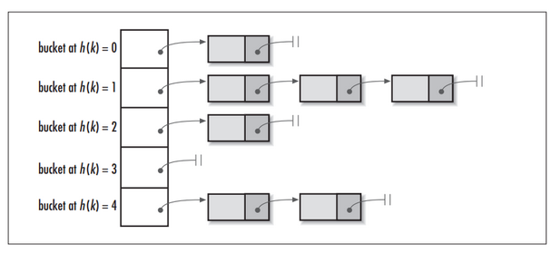

## HashMap

### Hash

- Hash，亦称为 "散列"，“哈希”；可以把任意长度的输入，通过散列算法，变换成固定长度的输出，该输出就是散列值。（这种转化是一种压缩映射，也就是，散列值的空间通常远小于输入的空间，不同的输入可能会散列成相同的输出，所以不可能从散列值来唯一的确定输入值。）简而言之：一种将任意长度的消息压缩到某一个固定长度的消息摘要的函数。

    - **注意**：根据同一散列函数计算出来的散列值如果不同，输入值肯定不同，但是，根据同一散列函数计算出来的散列值如相同，则值不一定不同
    - **两个不同的输入值，根据同一散列函数计算出的散列值相同的现象叫做*碰撞***

- 常用的 Hash 函数 如下

    - ~~~tex
        1: 直接定址法：直接以关键字k或者k加上某个常数（k+c）作为哈希地址。
        
        2: 数字分析法：提取关键字中取值比较均匀的数字作为哈希地址。
        
        3: 除留余数法：用关键字k除以某个不大于哈希表长度m的数p，将所得余数作为哈希表地址。
        
        4: 分段叠加法：按照哈希表地址位数将关键字分成位数相等的几部分，其中最后一部分可以比较短。然后将这几部分相加，舍弃最高进位后的结果就是该关键字的哈希地址。
        
        5: 平方取中法：如果关键字各个部分分布都不均匀的话，可以先求出它的平方值，然后按照需求取中间的几位作为哈希地址。
        
        6: 伪随机数法：采用一个伪随机数当作哈希函数。
        ~~~

    - 上述介绍了 Hash 函数可能会发生碰撞。而**衡量一个 hash 函数的好坏的重要指标就是发生碰撞的概率以及发生碰撞的解决方案**。任何哈希函数基本都无法彻底避免碰撞，常见的解决碰撞方案有以下几种

        - 开放定址法
            - 这种方法就是一旦发生了冲突，就去寻找下一个空的散列地址，只要散列表足够大，空的散列地址总能找到，并将记录存入。
        - 链地址法
            - 将哈希表的每个单元作为链表的头结点，所有哈希地址为 i 的元素构成一个同义词链表。即发生冲突时就把该关键字链在以该单元为头结点的链表的尾部。
        - 再哈希法
            - 当哈希地址发生冲突用其他的函数计算另一个哈希函数地址，直到冲突不再产生为止。
        - 建立公共溢出区
            - 将哈希表分为基本表和溢出表两部分，发生冲突的元素都放入溢出表中。

### HashMap 的数据结构

#### 概述

- 在 Java 中，保存数据有两种比较简单的数据结构：数组 和 链表。**数组的特点是：寻址容易，插入和删除困难；而链表的特点是：寻址困难，插入和删除容易；**常用的哈希函数的冲突解决办法中有一种方法叫做链地址法，其实就是将数组和链表组合在一起，发挥两者的优势，可以称其为链表的数组。
    - 
    - 上图可以看出，左侧明显是一个数组，数组的每个成员是一个链表。该数据结构所容纳的所有元素均包含一个指针，用于元素间的链接。根据元素的自身特征把元素分配到不同的链表中去，反过来我们也正是通过这些特征找到正确的链表，再从链表中找出正确的元素。其中，根据元素特征计算元素数组下标的方法就是哈希算法，即 hash() 函数（包括 indexOf() 函数）

#### hash 方法

##### 概述

- 同一版本jdk中，HashMap，HashTable，ConcurrentHashMap 中的 hash 方法的实现都不同。其次 不同的 jdk版本中也是有区别，主要以 1.7 - 1.8 为例。
- hash 方法的功能是根据 key 来定位这个 k-v 在链表数组中的位置，也就是 hash 方法的输入应该是个 object 类型的 key，输出应该是个 int 类型的数组下标。

