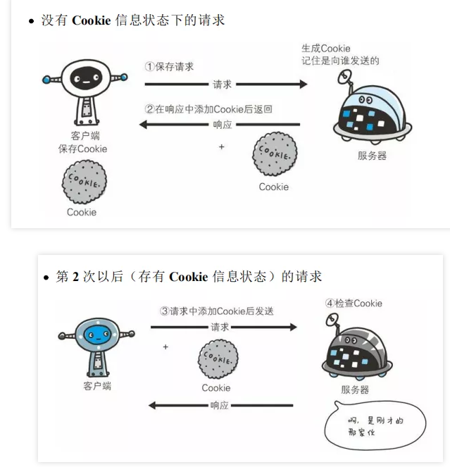
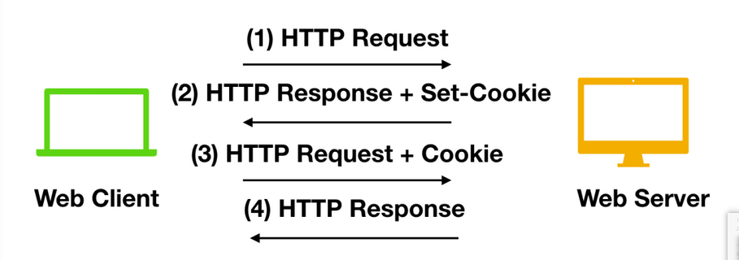

### 计算机网络

#### [计算机网络前提概要](https://www.cnblogs.com/zyx110/p/11824334.html)

- 硬件-底层，操作系统-中间层，软件-上层
- 操作系统-承上启下的作用，软件发号命令到操作系统，操作系统去调用硬件执行。
- 软件 - 人给计算机传输思想的工具

#### [网络通信](https://www.cnblogs.com/zyx110/p/11821412.html)

##### [计算机网络原理](https://www.cnblogs.com/zyx110/p/11891335.html)

- 网络按地域分类：
    - 局域网：一个公司，一个家庭，一个学校
    - 城域网：一个地区，一个城市
    - 广域网：一个国家，全世界
        - 粗狂的理解：全世界是一个局域网，各个地方通过网线连接到了一起。

##### 互联网协议的分布和设计

- [协议](https://blog.csdn.net/qq_43561410/article/details/89180039)

##### OSI 协议

- OSI 体系 七层体系结构的概念清楚，理论也较完善，但复杂的同时不实用，导致使用者较少OSI七层参考模型：
- OSI七层参考模型：
- 应用层
- 表示层
- 会话层
- 传输层
- 网络层
- 数据链路层
- 物理层

##### TCP/IP 协议

- 应用层
    
    - 对应常见协议：HTTP，FTP，DNS，SMTP，Telnet，TFTP，SSH，Ping命令
- 主机到主机层
    
    - TCP，UDP
- 互联网层
    
    - IP
- 网络接口层
    
- Ethernet，802.3，PPP
    
- TCP/IP 模型的层间通信和数据封装和解封装

    - 

    - 

    - 上图可能不怎么清晰，概述一下， 每个分层中，在这个首部中包含了该层必要的信息，如发送的目标地址以及协议相关信息。通常，为协议提供的信息为包首部，所要发送的内容为数据。在下一层的角度看，从上一层中收到的包全部被认为是本层的数据。

    - 

    - 详细的实际传输流程分解图（以a --> b 传输为例）

    - 

        - 1：应用程序 发送端 处理
            - 首先应用程序会进行编码处理，这些编码相当于OSI 的表示层功能。
                - 编码转化后，邮件不一定马上被发送出去，这种何时建立通信连接何时发送数据的管理功能，相当于OSI的会话层功能。
        - 2：TCP 模块的 发送端 处理
            - TCP 根据应用的指示，负责建立连接，发送数据以及断开连接。TCP 提供将应用层发来的数据顺利发送至对端的可靠传输。为了实现这一功能，需要在应用层数据的前端附加一个 TCP 首部。
        - 3：IP 模块的 发送端 处理
            - IP 将 TCP 传过来的 TCP 首部和 TCP 数据合起来当作自己的数据，并在TCP首部的前端加上自己的 IP 首部。IP 包生成后，参考路由控制表决定接收此 IP 包的路由或主机。
        - 4：网络接口（以太网驱动）的 发送端 处理
            - 从 IP 传过来的 IP 包对于以太网来说就是数据。给这些数据附加上以太网首部并进行发送处理，生成的以太网数据包将通过物理层传输给接收端。
        - 5：网络接口（以太网驱动）的 接收端 处理
            - 主机收到以太网包后，先从以太网首部找到 MAC 地址判断是否为发送给自己的包，若不是则丢弃数据。
                - 若是发送给自己的包，则从 以太网首部中的类型确定数据类型，再传给相应的模块，如IP，ARP等。（下面以 IP 为例子）
        - 6：IP 模块的 接收端 处理
            - IP 模块接收到数据后，先会进行类似的处理，从包首部中判断此 IP 地址 是否与 自己的 IP 地址匹配，如果匹配 则根据首部的协议类型将数据发送给对应的模块，如 TCP，UDP。（这里以 TCP 为例子）
        - 7：TCP 模块的 接收端 处理
            - 在 TCP 模块中，首先会计算一下 校验和，判断数据是否会被破坏，然后检查是否在按照序号接收数据，确定具体的应用程序。数据被完整的接收以后，会传给由端口号识别的应用程序。
        - 8：应用程序的 接收端 处理
            - 接收端应用程序 会直接接收发送端发送的数据。通过解析数据，展示相应的内容。

    - 传输层中的 TCP 和 UDP

        - TCP

            - 面向连接，可靠的流协议。流指不间断的数据结构。TCP 为提供可靠性的传输，实行 “顺序控制”，“重发机制”，此外还具备 “流控制(流量控制)”，“拥塞控制”，提高网络利用率等众多功能。

        - UDP

            - 不具有可靠性的数据报协议，细微的处理它会交予上层的应用完成，因此，虽然可以确保发送消息的大小，却不能保证消息一定会到达，因此，应用有时会根据自己的需要进行重发处理。

        - 端口号

            - 数据链路 和 IP 中的地址，分别指的是 MAC 地址和 IP 地址，前者用来识别同一链路中不同的计算机，后者用来识别 TCP/IP 网络中互连的主机和路由器。在传输层也有这种类似于 地址的概念，那就是端口号。端口号用来识别 同一台计算机中 进行通信的不同应用程序。因此，它被称为程序地址。

                - 根据端口号识别应用

                    - 一台计算机同时可以运行多个程序，传输层协议正是利用这些端口号识别本机中 正在进行通信的 应用程序，并准确的将数据传输。
                    - 

                - 通过 IP 地址，端口号，协议号进行通讯识别

                    - 仅凭目标端口号 识别某一个通信是不够的

                    - 

                        - ① 和② 的通信是在两台计算机上进行的。它们的目标端口号相同，都是80。这里可以根据源端口号加以区分。

                            ③ 和 ① 的目标端口号和源端口号完全相同，但它们各自的源 IP 地址不同。

                            此外，当 IP 地址和端口号全都一样时，我们还可以通过协议号来区分（TCP 和 UDP）。

                    - 端口号的确定

                        - 标准既定的端口号：指每个应用程序都有其指定的端口号，但并不是说可以随意使用任何一个端口号，比如 HTTP，FTP等知名的协议所使用的端口就是固定的，主要分布在 0~1023之间；除了知名端口号之外，还有一些端口号被正式注册，主要分布在 1024~49151 之间，不过这些端口号可用于任何通信用途。而49151~65535之间

                    - 端口号与协议

                        - 端口号由其使用的传输层协议决定，因此，不同的传输层协议可以使用相同的端口号
                        - 此外，那些知名端口号与传输层协议并无关系。只要端口一致都将分配同一种应用程序进行处理。

###### TCP和UDP 传输区别

- TCP
    - 具备数据传输时各种控制功能，可以进行丢包时的重发控制，还可以对次序乱掉的分包进行顺序控制。而这些在 UDP 中都没有。
    - TCP 作为一种面向连接的协议，只有在确认通信对端存在时才会发送数据，从而可以控制通信流量的浪费。
    - 根据 TCP 的机制，在 IP 这种无连接的网络也能实现高可靠性的通信（通过校验和，序列号，确认应答，重发控制，连接管理以及窗口控制等机制实现）

- UDP
    - UDP 不提供复杂的控制机制，利用 IP 提供面向无连接的通信服务。
    - UDP - 应用程序发来的数据在收到的那一刻，立即按照原样发送到网络的一种机制。即使是出现网络拥堵的情况。UDP 无法进行流量控制等避免网络拥塞行为。
    - 如果传输过程中，出现丢包行为，UDP 不负责重发。甚至当包的到达顺序出现乱序时也没有纠正的功能
    - UDP 常用于以下几个方面：
        - 视频-音频等多媒体通信(及时通信)
        - 广播通信(广播，多播)
        - 包总量较少的通信(DNS，SNMP等)
        - 限定于 LAN 等特定网络中的应用

###### TCP三次握手和四次挥手

- 概述：TCP 提供面向有连接的通信传输。面向有连接是指在数据通信开始之前先做好两端之间的准备工作。
- TCP 三次握手
    - 所谓三次握手是指建立一个 TCP 连接时需要客户端和服务端总共发送三个包以确认连接的建立。在socket编程中，这一过程由客户端执行connect来触发。
    - 以下图(生活打电话)为例
        - 
    - 对应为客户端和服务端之间的通信（TCP三次连接握手）
        - 
- TCP 四次挥手
    - 1：客户端向服务器端发送一个 FIN，请求关闭数据传输。
    - 2：当服务器接收到客户端的 FIN时，向客户端发送一个 ACK，其中 ACK 的值等于 FIN + SEQ
    - 3：然后服务器向客户端发送一个 FIN，告诉客户端应用程序关闭。
    - 4：当客户端收到服务端的 FIN时，回复一个 ACK 给服务器，其中 ACK 的值等于 FIN + SEQ
    - .png)
        - 为什么要 4次挥手
            - 确保数据完整传输
            - 当被动方收到主动方的 FIN 报文通知时，仅仅表示主动方没有数据再发送给被动方。但未必被动方所有的数据都完整的发送给了主动方，所以被动方不会马上关闭 socket，它后续可能还需要发送一些数据给主动方后，再发送 FIN 报文给主动方，告诉主动方同意关闭连接，所以这里的 ACK 报文和 FIN 报文多数情况下都是分开发送的。
- TCP 报文格式
    - 

#### HTTP协议

##### 概述

- Http 是一个超文本传输协议，主要用于客户端和服务器端之间的通信。
    - 超文本 -- 指HTML，CSS，JavaScript 和 img 等，最初主要为了接收和发布 HTML页面，经过后续的发展，已可以用于接收一些音频，视频，文件等内容。
    - 客户端 - 服务器端：
        - 请求文件 or 图片等资源的一方，通常叫做客户端。
        - 负责接收，提供响应的一方称为服务器端。

##### 特点

- 特点概述：支持客户端，服务器端模式，简单快速，客户端向服务器端请求服务时，只需传送请求方法和路径（灵活），HTTP允许传输任意类型的数据对象，无连接，限制每次连接只处理一个请求，无状态，HTTP 协议是无状态协议，指明协议对于事务处理没有记忆能力。
    - HTTP 都是由客户端 发起请求，服务端回应响应消息。
    - 灵活 - 允许任何类型的数据对象，包括音频，视频，图片，文件等。
    - 无状态 - 每一次的 HTTP 请求都是独立，任何两个请求之间没有必然的联系。
    - 无连接的，每次服务器处理完客户端的请求后，并收到客户的应答后，就断开了通信，当客户端再次发送请求时就是一个新的连接，采用这种方式可以节省传输时间。
        - 上述无连接时在 HTTP / 1.0 版本的主要缺点，但是在 HTTP / 1.1 版本后 虽然还是无状态协议，但为了实现期望的保持状态功能，引入了 Cookie 技术，有了 Cookie 和 HTTP 协议通信，就可以管理状态了。
        - 
        - TCP 连接的新建成本较高，因为需要客户端和服务器端三次握手，而在 HTTP 1.1 版本中，可以持久连接，TCP 连接默认不关闭，可以被多个请求复用，只有在一段时间内，没有请求，就可以自动关闭。
    - HTTP 工作原理：
        1. 客户端连接 Web 服务器
        2. 发送 HTTP 请求
        3. 服务器接收请求并返回 HTTP 响应
        4. 释放连接 TCP 连接
        5. 客户端浏览器解析 HTML 内容

##### 面试题

- [原网址](https://mp.weixin.qq.com/s/t7ZYT6wBBbFYVBPOSztpRg)

###### Htpp 和 Https 的区别

- 简单来说：Http 是未经安全加密的协议，它的传输过程容易被攻击者监听，数据容易被伪造，发送方和接收方都较容易被伪造；而 Https 是安全的协议，通过 密钥交换算法 - 签名算法 - 对称加密算法(非对称加密算法) - 摘要算法 能够解决上面这些问题。
- Https 实际上是比 Http 多了 一层 TLS/SSL 协议组合而成，也就是安全性

###### Get 和 Post 区别

- get 常用于请求，比如输入 www.baidu.com ，这是发送了一个 get 请求，主要特征是请求服务器返回资源，而 post 方法一般用于 表单 的提交，相当于是把信息提交给 服务器，等待服务器作出响应；get 相当于一个 pull / 拉 的操作，而 post 相当于一个 push / 推 的操作。
- get 相对不安全，因为参数 跟在 url 后面；post 参数放在请求体的 body 中，对普通用户来说不可见。
- get 请求 url 有长度限制，post 请求并没有
- get 请求会被浏览器主动 cache ，而post 不会（手动设置除外）
- get 请求在浏览器 反复的 回退 / 前进 操作是无害的，而 post 操作会再次提交表单请求
- get 请求在发送过程会产生一个 TCP 数据包，而 post 在发送过程中，会产生两个数据包。get 方式的请求，浏览器会把 http header 和 data 一起发送出去，服务器与之响应；而对于 post 浏览器先发送 header，服务器响应 100 状态码，浏览器 在发送对应 data 数据，服务器随之响应数据

###### 无状态协议是什么，HTTP 是无状态协议吗，如何解决

- 无状态协议 指浏览器对于事务的处理没有记忆能力。比如：客户请求获得网页之后关闭浏览器，然后再次启动浏览器，登录该网站，但服务器并不知道客户关闭了一次浏览器。
    - Http 就是一种无状态的协议，这种协议对于用户操作是没有记忆能力的，但为什么用户登录了一次之后，下次可以不用在重新输入用户名 和 密码呢，这其中并不是 Http 做的事情，而是一个叫 Cookie 的机制，这种机制让浏览器 具有了 记忆能力。
- 
- 
- 当用户在浏览器 设置中 没有禁用 Cookie 机制的时候，浏览器的 记忆功能就已经开启，如上图所示 当客户端发送第一次请求的时候，服务端接收到后，会开辟一块 Session 空间(用户空间-每一个用户都有独立的一块 Session 空间)，同时生成一个 SessionID，并通过响应头的 Set-Cookie，向客户端发送要求设置 Cookie 的响应；客户端收到响应后，在本机客户端设置了一个 Cookie 信息，该 Cookie 的过期时间为浏览器会话结束。（之后客户端每次向同一个 网站发送请求，请求头都会带上该 Cookie 信息(包括 SessionID)，然后，服务器读取请求头中的 Cookie 信息，获取其中的值，得到该次请求的 SessionID，就此，浏览器具有了记忆能力） 
- 第二种方式：JWT
    - 与 Cookie 不同，JWT 保存在客户端，广泛应用于单点登录。
        - 比如 Cookie 中存储的是一个 SessionID（服务器端需要对应存储该SessionID信息，需要开辟一块内存空间），而JWT中存储了整个信息（无需在服务器端开辟一块内存空间），且 JWT 可以进行多次验证
        - JWT 支持跨域认证，Cookies 只能用于 单个节点的域 或者其 子域中有效（如果尝试同通过第三个节点访问，会被禁止）。

###### UDP 和 TCP 的区别

- 概述：UDP 和 TCP 都处于计算机网络模型中的 运输层，主要负责传输应用层产生的数据。

    - UDP
        - UDP 概述：
            - UDP 用户数据包协议，不需要所谓的 握手 操作，从而加快了通信速度，允许网络上的其他主机在接收方 同意通信之前进行数据传输。
        - UDP 主要特点
            - 
            - UDP 能够支持容忍数据包丢失的带宽密集型应用程序
            - UDP 具有低延迟的特点
            - UDP 能够发送大量的数据包
            - UDP 能够允许 DNS 查找，DNS 是建立在 UDP 之上的应用层协议
        - UDP 主要应用：
            - 语音 - 视频 - 直播
    - TCP 
        - TCP 概述：
            - TCP - 传输控制协议。能够确认计算机连接到 Internet 以及它们之间的数据传输。通过三次握手 来建立 TCP 连接，三次握手就是用来启动和确认 TCP 连接的过程。一旦连接建立后，就可以发送数据，当数据传输完成后，会通过关闭虚拟电路来断开连接。

- TCP 和 UDP 之间的区别

    - | TCP                                                          | UDP                                          |
        | ------------------------------------------------------------ | -------------------------------------------- |
        | TCP 面向连接的协议                                           | UDP 无连接的协议                             |
        | TCP 在发送数据前先需要建立连接，然后再发送数据               | UDP 无需建立连接就可以直接发送大量数据       |
        | TCP 会按照特定顺序重新排列数据包                             | UDP 数据包没有固定顺序，所有数据包都相互独立 |
        | TCP 传输的速度比较慢                                         | UDP 的传输会更快                             |
        | TCP 头部字节有 20字节                                        | UDP 的头部字节只需要 8个字节                 |
        | TCP 重量级的，在发送任何用户数据之前，TCP 都需要三次握手建立连接 | UDP 是轻量级的，没有跟踪连接，消息排序等     |
        | TCP 会进行错误校验，且能进行错误恢复                         | UDP 亦会错误检查，但会丢弃错误的数据包       |
        | TCP 有发送确认                                               | UDP 没有发送确认                             |
        | TCP 会使用握手协议（如：SYN，SYN-ACK，ACK）                  | 无握手协议                                   |
        | TCP 是可靠的，因为它可以确保将数据传送到路由器               | 在 UDP 中不能保证将数据传送到目标            |

- TCP 三次握手 和 四次挥手

    - TCP 三次握手

        - 前提概念：

            - | 消息类型 | 概述                                |
                | -------- | ----------------------------------- |
                | SYN      | 主要用于消息的初始化和建立连接      |
                | ACK      | 帮助对方确认收到的 SYN 消息         |
                | SYN-ACK  | 本地的 SYN 消息和 较早的 ACK 数据包 |
                | FIN      | 用来断开连接                        |

            - SYN - 同步序列编号，是 TCP / IP 建立连接时 使用的握手信号，在客户机 和 服务器之间建立 TCP 连接，首先会发送一个信号，客户端在接收到 SYN 消息时，就会在自己的段内生成一个随机值 X

            - SYN-ACK：服务器收到 SYN 后，打开客户端连接，发送一个 SYN-ACK 作为答复。确认号设置为 比接收到的 序列号多一个，即 X + 1，服务器为数据包选择的序列号是另一个随机数 Y。

            - ACK：确认字符，表示发来的数据已确认接收无误。最后，客户端将 ACK 发送给服务器。序列号被设置为所接收的确认值即 Y + 1。

            - 

                - 简述：案例
                    - 小明 - 客户端，小红 - 服务端
                        - 小明给小红打电话，接通后，小明说：喂，能听到吗，这就相当于连接建立。
                        - 小红给小明回应，能听到，你能听到我说的话吗，这就相当于是请求响应。
                        - 小明听到小红的回应，好的，这就相当于连接确认，在这之后 两者就可以进行信息交换，通话等。

    - TCP 四次挥手

        - 
        - 首先，客户端应用程序决定要终止连接(这里服务端也可以选择断开连接)。这会使客户端将 FIN 发送到服务器，并进入 `FIN_WAIT_1` 状态。当客户端处于 FIN_WAIT_1 状态时，它会等待来自服务器的 ACK 响应。
        - 然后第二步，当服务器收到 FIN 消息时，服务器会立刻向客户端发送 ACK 确认消息。
        - 当客户端收到服务器发送的 ACK 响应后，客户端就进入 `FIN_WAIT_2` 状态，然后等待来自服务器的 `FIN` 消息
        - 服务器发送 ACK 确认消息后，一段时间（可以进行关闭后）会发送 FIN 消息给客户端，告知客户端可以进行关闭。
        - 当客户端收到从服务端发送的 FIN 消息时，客户端就会由 FIN_WAIT_2 状态变为 `TIME_WAIT` 状态。处于 TIME_WAIT 状态的客户端允许重新发送 ACK 到服务器为了防止信息丢失。客户端在 TIME_WAIT 状态下花费的时间取决于它的实现，在等待一段时间后，连接关闭，客户端上所有的资源（包括端口号和缓冲区数据）都被释放。

        还是可以用上面那个通话的例子来进行描述

        - 小明对小红说，我所有的东西都说完了，我要挂电话了。
        - 小红说，收到，我这边还有一些东西没说。
        - 经过若干秒后，小红也说完了，小红说，我说完了，现在可以挂断了
        - 小明收到消息后，又等了若干时间后，挂断了电话。

###### 简单描述一下 HTTP 1.0/1.1/2.0 的区别

- HTTP 1.0

    - HTTP 1.0 仅仅提供了最基本的认证，这时候用户名和密码还未经加密，因此很容易收到窥探。
    - HTTP 1.0 被设计用来使用短链接，即每次发送数据都会经过 TCP 的三次握手和四次挥手，效率比较低。
    - HTTP 1.0 只使用 header 中的 If-Modified-Since 和 Expires 作为缓存失效的标准。
    - HTTP 1.0 不支持断点续传，也就是说，每次都会传送全部的页面和数据。
    - HTTP 1.0 认为每台计算机只能绑定一个 IP，所以请求消息中的 URL 并没有传递主机名（hostname）。

- HTTP 1.1

    - HTTP 1.1 使用了摘要算法来进行身份验证
    - HTTP 1.1 默认使用长连接，长连接就是只需一次建立就可以传输多次数据，传输完成后，只需要一次切断连接即可。长连接的连接时长可以通过请求头中的 `keep-alive` 来设置
    - HTTP 1.1 中新增加了 E-tag，If-Unmodified-Since, If-Match, If-None-Match 等缓存控制标头来控制缓存失效。
    - HTTP 1.1 支持断点续传，通过使用请求头中的 `Range` 来实现。
    - HTTP 1.1 使用了虚拟网络，在一台物理服务器上可以存在多个虚拟主机（Multi-homed Web Servers），并且它们共享一个IP地址。

- HTTP 2.0

    - `头部压缩`，由于 HTTP 1.1 经常会出现 **User-Agent、Cookie、Accept、Server、Range** 等字段可能会占用几百甚至几千字节，而 Body 却经常只有几十字节，所以导致头部偏重。HTTP 2.0 使用 `HPACK` 算法进行压缩。
    - `二进制格式`，HTTP 2.0 使用了更加靠近 TCP/IP 的二进制格式，而抛弃了 ASCII 码，提升了解析效率
    - `强化安全`，由于安全已经成为重中之重，所以 HTTP2.0 一般都跑在 HTTPS 上。
    - `多路复用`，即每一个请求都是是用作连接共享。一个请求对应一个id，这样一个连接上可以有多个请求。

- 地址栏输入 URL 发生了什么

    - 在地址栏输入 URL 回车后，浏览器会根据输入的 URL 地址，去查找域名是否被本地 DNS 缓存，不同浏览器对 DNS 的设置不同，如果浏览器 缓存了想访问的 URL 地址，就直接返回IP。如果没有缓存该 URL 地址，浏览器就会发起系统调用来查询本机的 Hosts 文件是否有配置IP 地址，如果找到，则直接返回，如果找不到，就向网络中发起一个 DNS 查询。

    - DNS 是什么，互联网中识别主机的方式有两种，通过 主机名 和 IP地址。（人通常喜欢用 名字 的方式进行记忆，但是通信链路中的路由却喜欢定长，有层次结构的 IP 地址，因此需要一种能够把 主机名 --> IP地址的 转化服务，而该种服务就是由 DNS 提供的）DNS 是一种由分层的 DNS 服务器实现的 分布式数据库，运行在 UDP 上，使用 53端口。

    - 

        - ~~~tex
            一般域名服务器的层次结构主要是以上三种，除此之外，还有另一类重要的 DNS 服务器，它是 本地 DNS 服务器(local DNS server)。严格来说，本地 DNS 服务器并不属于上述层次结构，但是本地 DNS 服务器又是至关重要的。每个 ISP(Internet Service Provider) 比如居民区的 ISP 或者一个机构的 ISP 都有一台本地 DNS 服务器。当主机和 ISP 进行连接时，该 ISP 会提供一台主机的 IP 地址，该主机会具有一台或多台其本地 DNS 服务器的 IP地址。通过访问网络连接，用户能够容易的确定 DNS 服务器的 IP地址。当主机发出 DNS 请求后，该请求被发往本地 DNS 服务器，它起着代理的作用，并将该请求转发到 DNS 服务器层次系统中。
            
            首先，查询请求会先找到本地 DNS 服务器来查询是否包含 IP 地址，如果本地 DNS 无法查询到目标 IP 地址，就会向根域名服务器发起一个 DNS 查询。
            ~~~

        - > 注意：DNS 涉及两种查询方式：一种是`递归查询(Recursive query)` ，一种是`迭代查询(Iteration query)`。《计算机网络：自顶向下方法》竟然没有给出递归查询和迭代查询的区别，找了一下网上的资料大概明白了下。
            >
            > 如果根域名服务器无法告知本地 DNS 服务器下一步需要访问哪个顶级域名服务器，就会使用递归查询；
            >
            > 如果根域名服务器能够告知 DNS 服务器下一步需要访问的顶级域名服务器，就会使用迭代查询。
            >
            > 在由根域名服务器 -> 顶级域名服务器 -> 权威 DNS 服务器后，由权威服务器告诉本地服务器目标 IP 地址，再有本地 DNS 服务器告诉用户需要访问的 IP 地址。
            >
            > - 第三步，浏览器需要和目标服务器建立 TCP 连接，需要经过三次握手的过程，具体的握手过程请参考上面的回答。
            > - 在建立连接后，浏览器会向目标服务器发起 `HTTP-GET` 请求，包括其中的 URL，HTTP 1.1 后默认使用长连接，只需要一次握手即可多次传输数据。
            > - 如果目标服务器只是一个简单的页面，就会直接返回。但是对于某些大型网站的站点，往往不会直接返回主机名所在的页面，而会直接重定向。返回的状态码就不是 200 ，而是 301,302 以 3 开头的重定向码，浏览器在获取了重定向响应后，在响应报文中 Location  项找到重定向地址，浏览器重新第一步访问即可。
            > - 然后浏览器重新发送请求，携带新的 URL，返回状态码 200 OK，表示服务器可以响应请求，返回报文。

