# 线程

## 线程和进程

[线程和进程的详细描述](https://mp.weixin.qq.com/s/FaHKGRI69TqDj0AJtNiVoA)

### 前言

> 先来看看一则小故事

我们写好的一行行代码，为了让其工作起来，我们还得把它送进城（**进程**）里，那既然进了城里，那肯定不能胡作非为了。

城里人有城里人的规矩，城中有个专门管辖你们的城管（**操作系统**），人家让你休息就休息，让你工作就工作，毕竟摊位（**CPU**）就一个，每个人都要占这个摊位来工作，城里要工作的人多着去了。

所以城管为了公平起见，它使用一种策略（**调度**）方式，给每个人一个固定的工作时间（**时间片**），时间到了就会通知你去休息而换另外一个人上场工作。

另外，在休息时候你也不能偷懒，要记住工作到哪了，不然下次到你工作了，你忘记工作到哪了，那还怎么继续？

有的人，可能还进入了县城（**线程**）工作，这里相对轻松一些，在休息的时候，要记住的东西相对较少，而且还能共享城里的资源。

> “哎哟，难道本文内容是进程和线程？”

可以，聪明的你猜出来了，也不枉费我瞎编乱造的故事了。

### 进程

- 代码 --> 编译后的二进制可执行文件 --> 运行，装载到内存 --> CPU 执行程序中的每一条指令 （这个运行中的程序，就被称为**进程**）

- ~~~tex
    假设考虑有一个会读取硬盘文件数据的程序被执行了，那么当运行到读取文件的指令时，就会去从硬盘读取数据，但硬盘的读写速度是很慢的，那么这个时候，CPU 不会去等待硬盘数据返回（如果等待返回，那么 CPU 的利用率会非常低）。
    
    做一个类比：烧水的时候，不会干等水烧开，而是在途中干一些其他事情，直到水烧开了，呜呜叫的时候在回来执行之后的操作；
    
    所以，当进程要从硬盘读取数据时，CPU 不会阻塞等待数据的返回，而是去执行另外的进程。当硬盘数据返回时，CPU 会收到个中断，于是 CPU 再继续运行这个进程。
    ~~~

    - 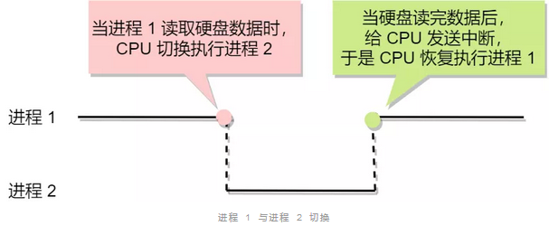

- 这种多个程序，交替执行的思想，就有 CPU 管理多个进程的初步想法；对于一个支持多进程的系统，CPU 会从一个进程快速切换至另一个进程，其中每个进程个运行几十 ~ 几百ms；虽然单核 CPU 再某一个瞬间，只能运行一个进程，但是再 1s 中，其可能运行多个进程，这样就产生了并发的错觉，但这实际上就是**并发**。

    - 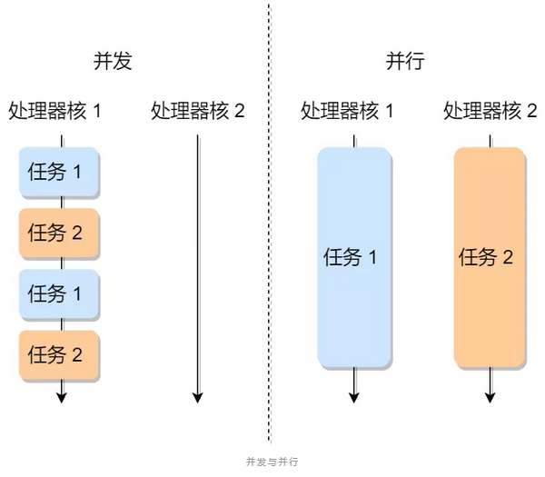

- 

## 多线程

- [多线程概述](https://mp.weixin.qq.com/s/g_eWT05_38AURchMIvNSnA)
- 同步 - 互斥 概述
    - 同步 - 概念
        - 多线程中，每个线程并不一定是顺序执行的，它们基本是各自独立，已不可预知的速度向前推进，但大多时候我们希望多个线程能密切合作，以实现一个共同的任务。
            - 例如：线程1 是负责读入数据，线程2 是负责处理数据，两个线程相互合作，相互依赖。线程2 在没有收到线程1 的唤醒通知时，就会一直阻塞等待，当线程1 读完需要把数据传给线程2 时，线程1 会唤醒线程2 ，并把数据交予线程2 处理。
                - 所谓同步，就是并发进程 / 线程 在一些关键点上可能需要互相等待与互通消息，这种相互制约的等待与互通信息称为 进线 / 线程 同步。
            - 或者如下图所示，可以完整的看到 线程同步的 流程 以及对应的操作
        - 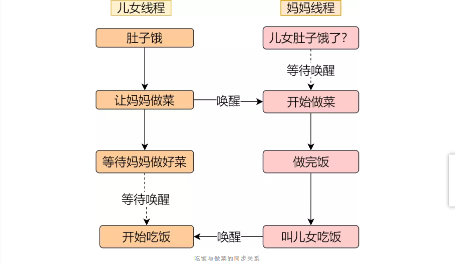
    - 互斥 - 概念
        - 互斥说白点，就是在一段时间内，只允许一个线程在**临界区**（由于多线程执行操作共享变量的这段代码可能会导致竞争状态，因此我们将此段代码称为临界区，它是访问共享资源的代码片段，一定不能给多线程同时执行）执行，其他线程应该被阻止进入临界区，简单说，在这段代码执行过程中，最多只能出现一个线程。
        - 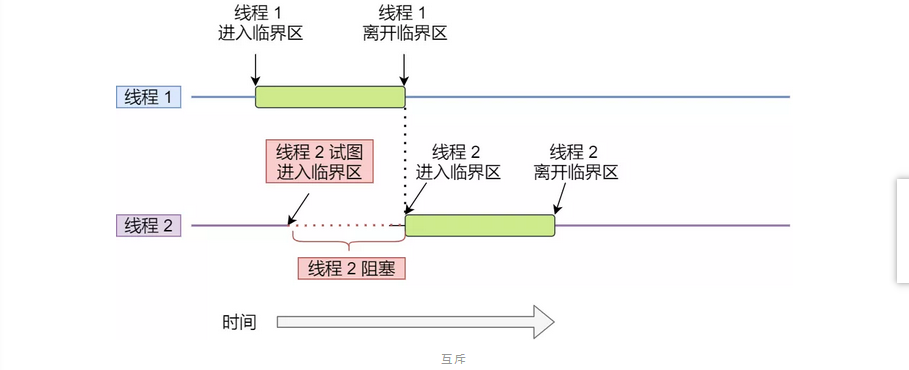
- 同步 - 互斥 两者差异
    - 同步 类似 --> 操作A 应在 操作B 之前执行，操作C 必须在 操作A 和操作B 都完成之后才能执行。
    - 互斥 类似 --> 操作A 和 操作B 不能在同一时刻执行。

## 锁

### 概述

- 使用 加解锁 操作可以解决并发线程 / 进程的互斥问题，任何想进入 临界区的线程，必须先执行 加锁操作。若加锁操作顺利通过，则线程可进入临界区，在完成对临界资源的访问后再执行解锁操作，以释放该临界资源。

### 等待锁

- 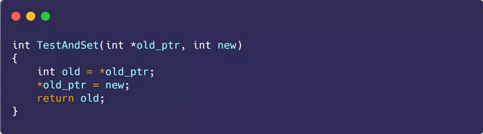
- 上述为 C 代码编写的 CPU体系结构提供的 特殊原子操作指令 -- 测试和置位（Test-and-Set）指令
    - 把 `old_ptr` 更新为 `new` 的新值
    - 返回 `old_ptr` 的旧值；
        - 这些代码都是原子执行。即可以测试旧值，又可以设置新值，所以这条指令叫做[测试并设置]
- 使用上述 测试并置位指令 可以用来实现 **等待锁**，如下图
    - 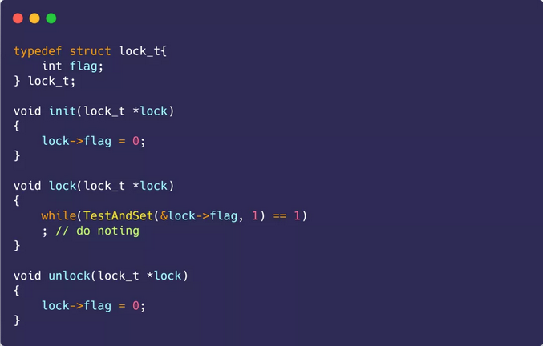
- 场景一（当该锁没有被持有，而被某线程持有的时候）：假设一个线程在运行，调用 lock()，没有其他线程持有锁，所以 flag 是 0。当调用 TestAndSet(flag，1) 方法，返回0，线程会跳出 while 循环，获取锁。同时也会原子的设置 flag 的值为 1，标志锁已经被持有。当线程离开临界区。调用 unlock() 将 flag 清理为 0。
- 场景二（当该锁被持有的时候，其他线程的动作）：当某一个线程已经持有锁（即 flag 为1）。该线程调用 lock()，然后调用 TestAndSet(flag，1)，这一次返回 1。只要另一个线程一直持有锁，TestAndSet() 会重复的返回1，该线程会一直等待。直到 flag 被修改为0，该线程会调用 TestAndSet()，返回 0 并且原子的 设置为1，从而获得锁，进入临界区。
    - 上述可以很明显看出，当获取不到锁的时候，线程会一直 while 循环，不做什么事情，直到获取锁，这种被称为 忙等待锁，也称自旋锁。（这是最简单的锁，一直自旋，利用 CPU 周期，直到锁可用。在单处理器上，需要抢占式的调度器（即不断通过时钟中断一个线程，运行其他线程）。否则，自旋锁在单 CPU 上无法使用，因为一个自旋的线程 永远不会放弃 CPU）

### 无等待锁

- 无等待锁 顾名思义 就是获取不到锁的时候，不用自旋。既然不想自旋，那当没获取到锁的时候，就把当前线程放入到锁的等待队列，然后执行调度程序，将CPU 让给其他线程执行。

### 信号量

- 概述：信号量 是 操作系统 提供的一种协调资源访问的方法。通常**信号量表示资源的数量**，对应的变量是一个整型（sem）变量；另外，还有两个原子操作的系统调用函数用于控制信号量的变化，分别为：
    - **P 操作**：将 sem 减 1，相减后，如果 sem < 0，则进程 / 线程 进入阻塞等待，否则继续，表明 P 操作可能会阻塞。
    - **V 操作**：将 sem 加 1，相加后，如果 sem <= 0，唤醒一个等待中的进程 / 线程，表明 V 操作不会被阻塞。
      
        - 
    - 操作系统如何实现 PV 操作的
        - 信号量数据结构 与 PV 操作的算法描述如下：
          
            - 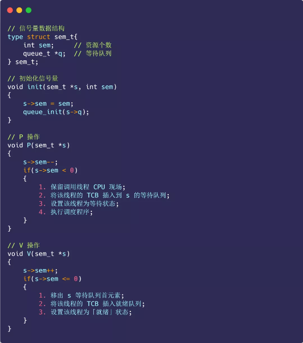
            
        - PV 操作的函数是由操作系统管理和实现，所以 PV 函数天然具有原子性
        
        - PV 操作如何使用
            - 信号量可以实现临界区的互斥访问控制，还可以线程间的事件同步。
                - **信号量实现临界区的互斥访问**
                    - 为每类共享资源设置一个 信号量 s，初值为 1，表示该临界资源未被占用。只要把进入临界区的操作 置于 P(s) 和 V(s) 之间，即可实现 进程 / 线程互斥。
                    - 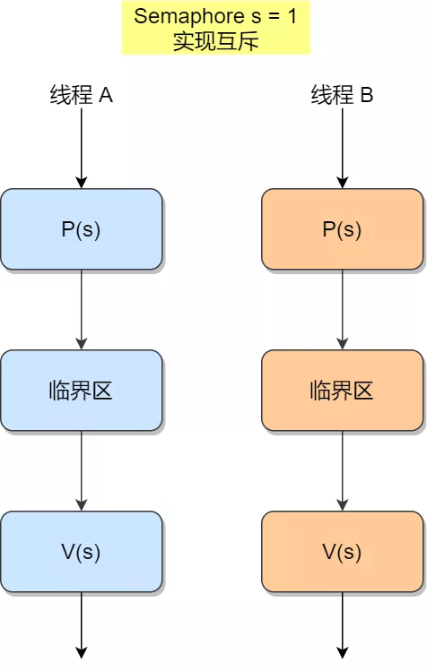
                    - 这时，任何想进入 临界区 的线程，必须在 互斥信号量上 执行 p 操作，在完成对临界资源的访问后 在执行 V 操作。
                        - 如果第一个线程进入临界区，由于 互斥信号量的 初始值为 1，故第一个线程执行 P 操作后，将信号量 该为 0，表示临界资源为空闲，可分配该线程，使之进入临界区。
                        - 如果第二个线程想进入临界区，也会先执行 P 操作，结果 s 变为负值，表示临界区已被占用，因此，第二个线程被阻塞。
                            - 直到第一个线程 执行 v 操作，释放临界资源而恢复 s 值为 0 后，才唤醒第二个线程，使之进入临界区，待它完成临界资源的访问后，又执行 v 操作，使 s 恢复到 初始值 1。
                                - 对于两个并发线程，互斥信号量的值 仅取 1，0，-1 三个值。
                                    - 1 - 表示没有线程进入临界区
                                    - 0 - 表示有一个线程进入临界区
                                    - -1 - 表示一个线程进入临界区，另外一个线程等待进入。
            - **信号量实现临界区的同步访问**
                - 同步的方式 是设置一个信号量，其初值为 0。用前面线程同步案例 - 做饭 - 吃饭 为例子，使用代码实现。
                
                    - 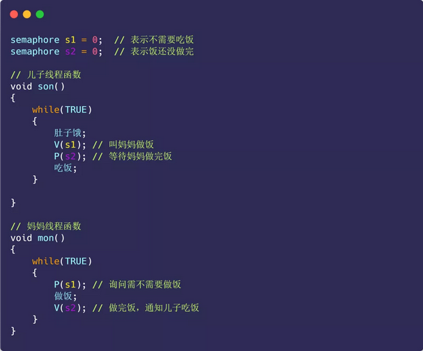
                
                    - 妈妈一开始询问儿子要不要做饭时，执行的是 `P(s1)` ，相当于询问儿子需不需要吃饭，由于 `s1` 初始值为 0，此时 `s1` 变成 -1，表明儿子不需要吃饭，所以妈妈线程就进入等待状态。
                
                        当儿子肚子饿时，执行了 `V(s1)`，使得 `s1` 信号量从 -1 变成 0，表明此时儿子需要吃饭了，于是就唤醒了阻塞中的妈妈线程，妈妈线程就开始做饭。
                
                        接着，儿子线程执行了 `P(s2)`，相当于询问妈妈饭做完了吗，由于 `s2` 初始值是 0，则此时 `s2` 变成 -1，说明妈妈还没做完饭，儿子线程就等待状态。
                
                        最后，妈妈终于做完饭了，于是执行 `V(s2)`，`s2` 信号量从 -1 变回了 0，于是就唤醒等待中的儿子线程，唤醒后，儿子线程就可以进行吃饭了。
            
        - 案例：
        
            - 互斥案例 - 生产者 - 消费者 问题
        
                - 
        
                - 生产者-消费者问题描述：
        
                    - **生产者**在生成数据后，放在一个缓冲区中；
                    - **消费者**从缓冲区取出数据处理；
                    - 任何时刻，**只能有一个**生产者或消费者可以访问缓冲区；
        
                    我们对问题分析可以得出：
        
                    - 任何时刻只能有一个线程操作缓冲区，说明操作缓冲区是临界代码，**需要互斥**；
                    - 缓冲区空时，消费者必须等待生产者生成数据；缓冲区满时，生产者必须等待消费者取出数据。说明生产者和消费者**需要同步**。
        
                    那么我们需要三个信号量，分别是：
        
                    - 互斥信号量 `mutex`：用于互斥访问缓冲区，初始化值为 1；
        
                    - 资源信号量 `fullBuffers`：用于消费者询问缓冲区是否有数据，有数据则读取数据，初始化值为 0（表明缓冲区一开始为空）；
        
                    - 资源信号量 `emptyBuffers`：用于生产者询问缓冲区是否有空位，有空位则生成数据，初始化值为 n （缓冲区大小）；
        
                    - 具体的实现代码：
        
                        
        
                        如果消费者线程一开始执行 `P(fullBuffers)`，由于信号量 `fullBuffers` 初始值为 0，则此时 `fullBuffers` 的值从 0 变为 -1，说明缓冲区里没有数据，消费者只能等待。
        
                        接着，轮到生产者执行 `P(emptyBuffers)`，表示减少 1 个空槽，如果当前没有其他生产者线程在临界区执行代码，那么该生产者线程就可以把数据放到缓冲区，放完后，执行 `V(fullBuffers)` ，信号量 `fullBuffers` 从 -1 变成 0，表明有「消费者」线程正在阻塞等待数据，于是阻塞等待的消费者线程会被唤醒。
        
                        消费者线程被唤醒后，如果此时没有其他消费者线程在读数据，那么就可以直接进入临界区，从缓冲区读取数据。最后，离开临界区后，把空槽的个数 + 1。

## 同步-异步-阻塞-非阻塞

- 前提概述：我们都知道 一次 IO 操作必然会有三个角色的参与
    - 应用程序 - 内核 - 数据
    - 概述：以一次数据的读取为例，应用程序是没有办法直接操作硬件设备的，只有通过内核才能跟硬件交互。当网卡接收到数据之后，此时数据在网卡中，需要内核将网卡中的数据读取到内核空间中，再从内核空间拷贝到用户空间，这个时候应用程序才能拿到数据，读取数据结束。

#### 同步阻塞

- 案例：我和某一位大妈买东西，和其说好，然后她去家里取，而在取的过程中，我在原地等待大妈的返回。
    - 这里对比上述的角色：应用程序 - 我，内核 - 大妈，数据 - 买的东西。
        - 我需要这个东西，而这个东西需要经过大妈，而大妈需要将东西准备好，才能交予到我手上，在未准备好的情况下，大妈需要等待，而我需要等待大妈，最终大妈准好东西，并过来，我等到大妈，并拿到东西，结束。
            - 我需要等待大妈把东西拿过来，这里我是阻塞的，而我使用这个东西做什么，这个我是个人做，所以是一个同步的。
        - 类比上述应用程序 - 内核 - 数据为例：同步阻塞，相当于应用程序发起了一个 IO 请求（以读取数据为例），此时需要进行一次系统调用，内核由用户态切换到内核态，内核开始跟硬件设备进行交互从硬件设备中读取数据，此时可能硬件设备还没有接收到数据，所以内核函数一直阻塞，直到数据到达才进行返回。

#### 同步非阻塞

- 案例：还是和大妈买东西，但是这次大妈不需要去家里取，而是我挑选好东西后，大妈说稍后送货上门，全部包办，你去忙你的就好，即我这边在挑选好东西后，无需等待，而是在之后每隔一段时间询问一下是否到货，之后忙自己的即可。
    - 对比这次，大妈不同，包货到家，只需要在中途询问一下是否到了，在此期间我可以做任何事情，所以我和东西之间是为阻塞的，但是后续使用这个东西，对于我来说是同步的，所以是 同步非阻塞。
    - 类比应用程序的 IO，当应用程序发起了一次读取数据的请求，还是会发起系统调用，但是此时内核根据硬件中是否有数据执行不同的操作，如果有数据，那么将数据拷贝到用户空间，如果没有数据也会返回一个标志，如-1，应用程序在轮询期间并没有一直阻塞，而是可以进行执行。这就是同步非阻塞。

#### 异步非阻塞

- 案例：老大妈了，但这次就不同了，大妈说：你要什么东西，拿这个东西做什么，我一手包办了。

    - 好比，我向大妈发起了一个 炒肉请求，大妈自己把原材料，调料，厨师全部配齐，并弄好，之后送达到我手上，一条龙服务。

    - 类比应用程序中的 IO，应用程序只需要发起一次读取数据的请求，接下来就等着内核将数据拷贝到用户空间，并且内核将数据拷贝完成后会通知应用程序，在整个过程中程序可以继续往下执行。类似下方代码

        - ~~~java
            read(byte[], 回调函数，当内核执行完操作后执行该回调函数)
            并无阻塞，运行完上方后，继续执行下方
            ~~~

#### 概述

- 通俗的语言描述：
    - 阻塞 / 非阻塞：描述的是发起请求的人的状态，比如：我发起买东西的请求后，一直处于阻塞状态，一直在原地等待，什么都不能做。
    - 同步 / 异步：代表是请求被完成的方式，如果最终还是由我完成的，就是同步，如果不是由我完成，而是别人完成后通知我的就是异步。
- 专业的话来说
    - 阻塞 / 非阻塞：描述的是调用者调用方法后的状态，比如：线程A 调用了 B 方法，A线程处于阻塞状态。
    - 同步 / 异步：描述的方法跟调用者间通信的方式，如果不需要调用者主动等待，调用者调用后立即返回，然后方法本身通过回调，消息通知等方式通知调用者结果，就是异步。反之，如果调用方法后一直需要调用者一直等待方法返回结果，那么就是同步。
- 由此可以得出，异步阻塞没有意义，且也不存在异步阻塞的说法，因为，事情都不需要我做了，阻塞什么。

### CAS

- 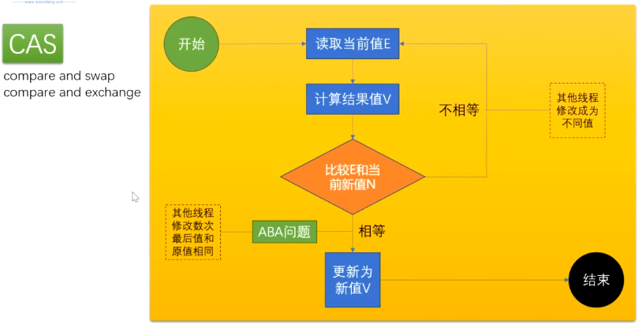
- CAS 的思想：

## Java锁的分类

### 单个锁的优化

- 对单个锁优化的效果就像提高单个CPU的处理能力一样，最终会由于各个方面的限制而达到一个平衡点，到达这个点之后优化单个锁的对高并发下面锁的优化效果越来越低。所以将一个锁进行粒度细分带来的效果会很明显，如果一个锁保护的代码块被拆分成两个锁来保护，那么程序的效率就大约能够提高到2倍，这个比单个锁的优化带来的效果要明显很多。常见的 锁粒度细分技术有：**锁分解**和**锁分段**。

#### 锁粒度细分

- 锁的粒度细分主要有：锁分解和锁分段两种方式，他们的核心都是降低锁竞争发生的可能性。
    - 锁分解
        - 缩小锁的范围
        - 概念：同一个方法中只锁该锁的代码，无关代码块去除锁，锁操作的代码块减少，锁竞争的可能性也会减少。
        - 

### 性质分类

#### 公平锁-非公平锁

- 公平锁：指多个线程按照申请锁的顺序获取锁
- 非公平锁：指线程不是按照申请锁的顺序进行，而是后申请的线程比先申请的线程优先获取锁。有一定可能造成优先级反转 或者 线程饥饿(一上来就争取锁，而非排队，类似一个队列，后面的人上来先尝试一下是否能插队，先插队一下，成功就获得，失败就排队)
    - ReentrantLock 可以在创建的时候，在构造函数中传入 true 或者 false 指定其是否为公平锁 还是 非公平锁，非公平锁的优点在于吞吐量比公平锁大。
    - Synchronized 是一种公平锁，不能转向非公平锁。

#### 乐观锁-悲观锁

- 概述：乐观锁 和 悲观锁 并不是指 具体什么类型的锁，而是指看待并发同步的角度。
    - 悲观锁
        - 悲观锁认为对于同一个数据的并发操作，一定会发生修改，即便没有发生，也会主观认定其会，因此对于同一个数据的并发操作，悲观锁采取加锁的形式。主观上的悲观认为其不加锁一定会发生问题。
    - 乐观锁
        - 乐观锁认为对于同一个数据的并发操作，是不会发生修改，在更新数据的时候，会采用尝试更新，不断重新获取的方式更新数据，乐观的认为，不加锁的并发操作是不会发生事情的。
    - 悲观锁在Java 中为 synchronized 等同步锁。
    - 乐观锁为无锁编程，常为 CAS 算法，典型的例子就是原子类，通过CAS 自旋实现原子操作的更新。
    - 两种锁的总结：
        - 在并发量非巨大的情况下，乐观锁的效率 > 悲观锁的效率，但在并发量巨大，如线程1w个的时候，如果1w个线程自旋，效率非常低非常低。这个时候 悲观锁的效率就相对会好很多。
        - 悲观锁大致可以理解为一个线程队列，先到的先进，后到的后进；乐观锁大致理解为线程之间的争抢，先行尝试获取一下锁，如果获取失败则进入自旋尝试再次获取锁。

#### 独享锁-共享锁(互斥锁-读写锁)

- 独享锁是指该锁一次只能被一个线程所持有。
- 共享锁是指该锁可被多个线程所持有。
    - 独享锁 - 类似 Synchronized 等，都是独享锁
    - 共享锁 - 与Java 中而言，ReentrantLock 中的 ReentrantReadWriteLock 读锁共享，写锁独享（类似班级表，大家一起看，但笔只有一个，一次只能一个 人写）（口诀：读读共享，读写互斥，写写互斥）。
    - 独享锁 和 共享锁 都是通过 AQS 实现，通过实现不同的方法，实现不同的独享或者共享。
- 互斥锁 和 读写锁
    - 概念：独享锁 和 共享锁 就是一种广义上的 说法，互斥锁 和 读写锁就是具体的实现。
    - 互斥锁在 Java 中的具体实现 ReentrantLock ，读写锁在 Java 中的具体实现是 ReentrantReadWriteLock 

#### 可重入锁

- 可重入锁 又名 递归锁，是指在同一个线程在 外层方法获取锁的时候，在进入内层方法会自动获取锁。（比如：在某个方法中加了锁，但该方法内部调用了另外的方法，在进入这个方法的时候，会带上之前的锁进行）。在Java中 ReentrantLock 和 Synchronized 等都是可重入锁。

### 设计方案分类

#### 自旋锁-自适应自旋锁

- 概述：底层使用 CAS 算法进行，也叫 比较和替换，指当一个线程在获取锁的时候，如果锁已被其他线程获取，那么该线程将循环等待，然后不断的判断锁 是否能够被 成功获取，直到获取到锁才会退出循环
    - 自旋锁的好处在于减少了 线程上下文的切换的消耗，缺点循环消耗CPU资源。

#### 锁粗化-锁消除

- 锁消除是指虚拟机在 即时编译运行时，对一些代码上要求同步，但是如果检测到不可能存在共享数据竞争的锁进行消除，锁消除的主要判断依据来源于逃逸分析的数据支持，如果判断在一段代码中，堆上的所有数据都不会逃逸从而不会被其他线程访问到，那就可以把它们当作栈上数据对待，即认为它们是线程私有的，如此这样加锁就无须进行。
- 锁粗化是指如果一系列的连续操作都对同一个对象反复加锁和解锁，甚至加锁操作是在 循环体中的，即使没有线程竞争，频繁的进行互斥同步操作也会导致不必要的性能损耗，如果虚拟机探测到有这样一串零碎的操作都对同一个对象加锁，将会把加锁同步的范围扩展（粗化）到整个操作序列的外部。（简单来说，JVM分析代码发现某个方法只被单个线程安全访问，而且这个方法是同步方法，那么JVM就会去掉这个方法的锁）
- 两者的设计原理基本一致，都是为了减少没必要的加锁。

#### 偏向锁-轻量级锁-重量级锁

- 这三种锁是指锁的状态，主要针对 Synchronized，在 JDK5 通过引入锁升级的机制来实现高效的的 Synchronized，这三种锁的状态是通过对象监视器在对象头的字段来表明。
    - 偏向锁：如果一段代码一直被一个线程所访问，那么该线程会自动获取锁，降低获取锁的代价。
    - 轻量级锁：是指当锁是偏向锁的时候，被另外一个线程所访问，偏向锁就会升级为轻量级锁，其他线程会通过自旋的形式尝试获取锁，不会阻塞，以提高性能。
    - 重量级锁：在JDK6之前，自旋超过10次，线程数超过 cpu 二分之一的时候从轻量级升级到重量级，JDK6之后为自适应是否升级到重量级锁，如果升级到了重量级锁，该锁会让其他申请的线程进入阻塞，即排队一个个进行。

#### 分段锁

- 分段锁 是一种锁的设计，并不是具体的一种锁，对于 ConcurrentHashMap 而言，其的分段锁称为 **Segment**，它类似于 HashMap（JDK8的实现）的结构，**即内部拥有一个 Entry 数组，数组中的每个元素又是一个链表，同时又是一个 RenntrantLock（Segment 继承了 ReentrantLock）**，当需要 put 元素的时候，并不是对整个 HashMap 进行加锁，而是先通过 HashCode 来知道该值 要放在哪一个分段中，然后对这个分段进行加锁，所以当多线程 put 的时候，只要不是放在一个分段中，就实现了 并行 插入；但是，当统计 Size 的时候，是获取 HashMap 的全局信息的时候，就需要获取所有的分段锁才能统计，分段锁的设计目的是细化锁的粒度，当操作不需要更新整个数组的时候，就仅仅针对数据中的一项进行加锁操作。

## 锁升级过程(争对Synchronized)

- 前置知识：用户态 和 内核态

- ~~~reStructuredText
    1.操作系统需要两种CPU状态
      1.1. 内核态（Kernel Mode）：运行操作系统程序，操作硬件
      1.2. 用户态（User Mode）：运行用户程序
    
    2.指令划分
      2.1. 特权指令：只能由操作系统使用、用户程序不能使用的指令。 举例：启动I/O 内存清零 修改程序状态字 设置时钟 允许/禁止终端 停机
      2.2. 非特权指令：用户程序可以使用的指令。 举例：控制转移 算数运算 取数指令 访管指令（使用户程序从用户态陷入内核态）
      
    3.特权级别
      特权环：R0、R1、R2和R3
        --R0相当于内核态，R3相当于用户态；
        --不同级别能够运行不同的指令集合；
        
    4.CPU状态之间的转换
      4.1. 用户态--->内核态：唯一途径是通过中断、异常、陷入机制（访管指令）
      4.2. 内核态--->用户态：设置程序状态字PSW
      
    5.内核态与用户态的区别
      5.1. 内核态与用户态是操作系统的两种运行级别，当程序运行在3级特权级上时，就可以称之为运行在用户态。因为这是最低特权级，是普通的用户进程运行的特权级，大部分用户直接面对的程序都是运行在用户态；
      5.2. 当程序运行在0级特权级上时，就可以称之为运行在内核态。
      5.3. 运行在用户态下的程序不能直接访问操作系统内核数据结构和程序。当我们在系统中执行一个程序时，大部分时间是运行在用户态下的，在其需要操作系统帮助完成某些它没有权力和能力完成的工作时就会切换到内核态（比如操作硬件）。
    
      这两种状态的主要差别是
      	5.3.1. 处于用户态执行时，进程所能访问的内存空间和对象受到限制，其所处于占有的处理器是可被抢占的
        5.3.2. 处于内核态执行时，则能访问所有的内存空间和对象，且所占有的处理器是不允许被抢占的。
    
    6. 通常来说，以下三种情况会导致用户态到内核态的切换
      6.1. 系统调用
        6.1.1. 这是用户态进程主动要求切换到内核态的一种方式，用户态进程通过系统调用申请使用操作系统提供的服务程序完成工作。比如前例中fork()实际上就是执行了一个创建新进程的系统调用。
        6.1.2. 而系统调用的机制其核心还是使用了操作系统为用户特别开放的一个中断来实现，例如Linux的int 80h中断。
        6.1.3. 用户程序通常调用库函数，由库函数再调用系统调用，因此有的库函数会使用户程序进入内核态（只要库函数中某处调用了系统调用），有的则不会。
      6.2. 异常
        6.2.1. 当CPU在执行运行在用户态下的程序时，发生了某些事先不可知的异常，这时会触发由当前运行进程切换到处理此异常的内核相关程序中，也就转到了内核态，比如缺页异常。
      6.3. 外围设备的中断
        6.3.1. 当外围设备完成用户请求的操作后，会向CPU发出相应的中断信号，这时CPU会暂停执行下一条即将要执行的指令转而去执行与中断信号对应的处理程序，
        6.3.2. 如果先前执行的指令是用户态下的程序，那么这个转换的过程自然也就发生了由用户态到内核态的切换。比如硬盘读写操作完成，系统会切换到硬盘读写的中断处理程序中执行后续操作等。
    
    这3种方式是系统在运行时由用户态转到内核态的最主要方式，其中系统调用可以认为是用户进程主动发起的，异常和外围设备中断则是被动的。
    
    ~~~

- 重量锁 在早期 是直接从 用户态 --> 内核态进行控制，现在的锁除了重量锁还是需要转向内核态，其余锁可以在用户态中直接完成。

- 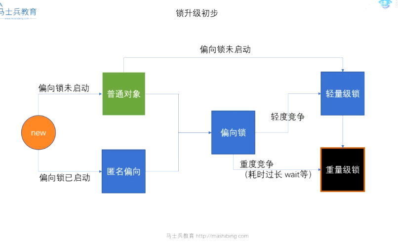

- 如上图所示：当一个对象 new 出来，如果你给其上锁，比如使用 synchronized 开始为偏向锁，如有轻度竞争了，转向轻量级锁，当出现重度竞争，会转向重量级锁，即从用户态 转向 内核态（偏向锁 和 轻量级锁不需要经过内核态，在用户态中即可完成，重量级锁需要陷入内核态完成）

### 偏向锁

- 案例：偏向锁：就类似一个线程，在某个门上贴了一个自己的标记，表示这里我暂了

### 轻量级锁(自旋锁)

- 案例：多个线程，竞争同一个门上的标记，然后某个抢到了标记，其他线程自旋争抢。(自旋就是 while 一直循环拿锁，直到拿到为止)（升级重量级条件 -- jdk1.6之前自旋超过10次，等待线程超过cpu核数的二分之一，jdk1.6之后 自适应自旋锁，一般参数不做调整，jdk会根据线程情况自行做出选择）

### 重量级锁

- 案例：当超多线程，竞争同一个门上的标记，（可能会导致cpu无法正常工作），升级到重量级锁(操作系统级别锁--内核态锁)，主要做法是系统 给出一个线程队列，所有线程到该队列里面，并冻结，直到叫醒你在执行，否则不做任何动作。

## volatile

### 线程可见性

- 缓存一致性协议
    - 前提理解：现在CPU 和 内存之间的速度差距较大，所以现在CPU大多都有三级缓存，一般使用 L1，L2，L3表示一级缓存，二级缓存，三级缓存。就有了 cache line 的概念（缓存行，即CPU会从内存读取 64个字节(当作一行) 读取到三级缓存中），即需要的值从内存中读取到 三级缓存中，而当其中一个值修改后，如何通知其他CPU，该值已被修改，如果有其他CPU从内存中读取了该值到缓存中，如何进行通知并重新读取最新值，这里就使用到了缓存一致性协议（但volatile的底层并没有使用到缓存一致性协议）
    - 缓存行
        - 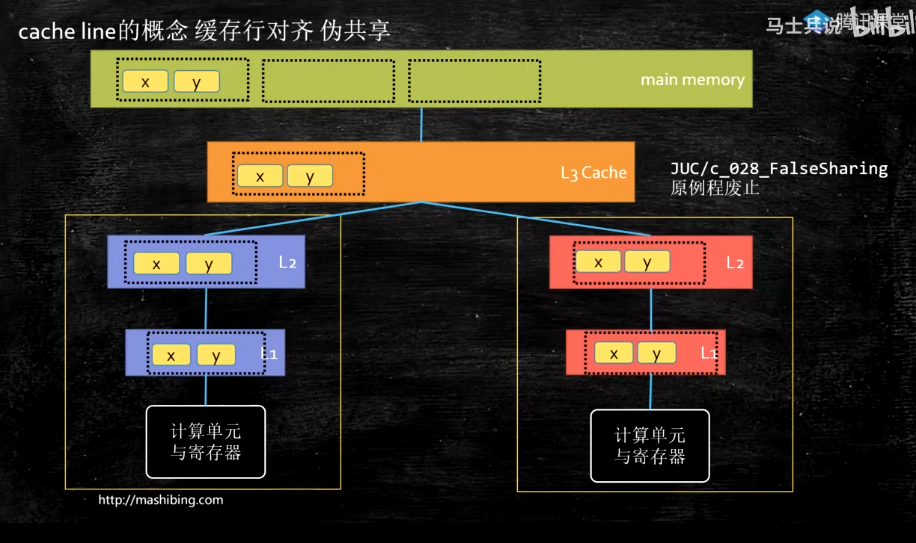
        - [缓存行和伪共享](https://www.jianshu.com/p/7f89650367b8)
    - 缓存一致性协议有很多种
        - MSI，MESI，MOSL，Synapse，Firefiy，Dragon等
        - 常见的是 MESL（英特尔的缓存一致性协议）
            - MESL 协议总计 四种状态
                - Modified
                    - 表示该缓存行 被我修改了
                - Exclusive
                    - 表示该缓存行被我独占
                - Shared
                    - 该缓存行共享
                - Invalid
                    - 该缓存行失效（他人修改后，通知并设置，如还需要使用，需从内存中重新读取）

### 禁止指令重排

- CPU 的乱序执行，CPU在进行读等待的同时执行指令，是CPU乱序的根源，不是乱，而是提高效率。
    - 为什么要防止指令重排（如下图）
    - 
    - 如果 洗水壶 --> 烧开水 --> 洗茶壶 --> 洗茶杯 --> 拿茶叶 --> 泡茶 是我们指定的任务顺序，但实际 可以在 烧开水的同时进行 洗茶壶，洗茶杯，后面的指令被调到前面执行了，即没有按照顺序执行，是因为cpu 速度很快，如果一直等其完成后在执行其他就很慢，且没有效率，所以就这种情况进行了 cpu 认为的优化，即后面相关性不大的指令会被拿到前面执行。
    - 内存屏障（解决CPU乱排序技术）
        - [简述](https://www.jianshu.com/p/60e510737f20) [cpu指令重排](https://blog.csdn.net/qq_26531719/article/details/102514567)
        - 概述：cpu 为了提高效率会对指令进行重排序，以适合 cpu 的顺序运行。但是指令重排会遵守 as-if-serial 的规则，就是所有的动作（Action）都可以为了优化而被重排序，但是必须保证它们重排序后的结果和程序代码本身的应有结果是一致的。所以这种情况在单线程中不会出现什么问题。而对于多线程，这个规则就失效了，所以可能会导致结果出现问题。由此就出现了内存屏障，也叫内存栅栏。是一种屏障指令，cpu 指令，Java的实现方式是 使用 volatile 进行防止 指令重排 和 内存可见性
        - 硬件层的内存屏障有
            - Load Barrier 和 Store Barrier（读屏障 和 写屏障，Java层的屏障有四种，分别为上面两种的组合）
                - Java层面 的四种
                - LoadLoad 屏障
                    - 比如有两个 读取指令，LoadOne，LoadTwo， 在 LoadTwo 要读取的数据在访问之前，保证 LoadOne 要读取的数据被读取完毕，即可使用该内存屏障
                - StoreStore 屏障
                    - 同理，有两个写指令，StoreOne，StoreTwo，在StoreTwo 写入执行前，保证StoreOne 的写入操作对其他处理器可见
                - LoadStore 屏障
                    - 在 Store 被写入前，保证 Load 需要读取的数据 读取完毕
                - StoreLoad 屏障
                    - Load 读取前，保证 Store 的写入操作对所有处理器可见（该屏障开销最大）
                - Java中 当一个 变量被 volatile 修饰后，JVM 会做两件事情
                    - 在每个 volatile 写操作前插入 StoreStore 屏障，在写操作后插入 StoreLoad 屏障。
                    - 在每个 volatile 读操作前插入 LoadLoad 屏障，在读操作后插入 LoadStore屏障

