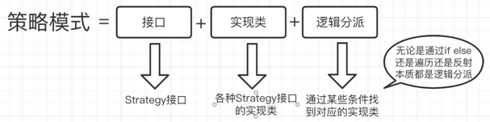

# 设计模式

## 核心思想

- 找出应用中可能需要变化之处，将其独立，不要和那些不需要变化的代码混在一起。
- 针对接口编程，而不是针对实现编程。
- 为了交互对象之间的松耦合设计而进行。

## 设计模式原则

### 单一职责原则

- **个人解释**：一个类只负责与自己相关的事情，其他应该放到对应的类中进行自行处理。
- **目的**：降低代码复杂度，系统解耦合，提高可读性。
- **含义**：对于一个类，只有一个引起该类变化的原因，该类的职责是唯一的，且这个职责是唯一引起其他类变化的原因。
- **解决**：将不同的职责封装到不同的类或者模块中，当有新的需求将现有的职责分为颗粒度更小的职责的时候，应该及时对现有代码进行重构。当系统逻辑足够简单，方法足够少，子类够少或后续关联够少时，也可以不必严格遵守 SRP 原则，避免过度设计，颗粒化严重。
- **实例**：电线类Wire为居民供电，电压为220v；但是新的需求增加，电线也输送高压电，电压为200kv，原有电线类可以增加方法实现扩充，这就违背了单一职责原则。可以提供基类，创建两个派生类，居民供电线、高压输电线。

### 里氏替换原则

- **个人解析**：既然继承就不要重写，否则总结出一个更基础的基类，用于继承。
- **目的：**避免系统继承体系被破坏
- **含义：**所有引用基类的地方必须能透明地使用其子类的对象。
- **解决**：子类可以实现父类的抽象方法，但是不能覆盖父类的非抽象方法；子类中可以增加自己特有的方法；当子类覆盖或实现父类的方法时，方法的前置条件（即方法的形参）要比父类方法的输入参数更宽松；当子类的方法实现父类的抽象方法时，方法的后置条件（即方法的返回值）要比父类更严格。如果子类不能完整地实现父类的方法，或者父类的一些方法在子类中已经发生畸变，则建议断开继承关系，采用依赖，聚合，组合等关系代替继承。
- 实例：已经定义鸟类具有两个翅膀飞的方法；新加入鸵鸟，不会飞，如果覆盖父类的方法，在两个翅膀飞的方法中什么也不做，就违背里氏替换原则，导致所有鸟都不会飞。应该创建并列的两种鸟基类，会飞与不会飞的。前置条件更宽松、后置条件更严格，比如父类返回Map，子类返回HashMap；父类接受HashMap形参，子类接受Map。

### 依赖倒转原则

- **个人解释**：能用接口就用接口，能用抽象就抽象，不要偷懒。除非没有后期可言。
- **目的**：避免需求变化导致过多的维护工作
- **含义**：高层模块不应该依赖低层模块，二者都应该依赖其抽象；抽象不应该依赖细节；细节应该依赖抽象。
- **解决**：面向接口编程，使用接口或者抽象类制定好规范和契约，而不去涉及任何具体的操作，把展现细节的任务交给他们的实现类去完成。
- **实例**：母亲类Mother有讲故事方法TellStory，依赖一个Book类输入，并使用了Book类的getContent方法以便讲故事。那么下次需要母亲讲报纸上的故事、手机上的故事时，原有接口无能为力。这时，抽象一个包含getContent方法的IReader基类，Book、Newspaper、Cellphone各自实现。母亲的TellStory方法接受一个IReader实例，并调用getContent方法即可。

### 迪米特法则

- **个人解释**：类与类之间的耦合最低限度的降低，符合单一职责原则的同时满足迪米特法则。
- **目的**：降低类与类之间的耦合。
- **含义**：每一个软件单位对其他的单位都只有最少的知识，而且局限于那些与本单位密切相关的软件单位。
- **解决**：非依赖，关联，组合，聚合等耦合关系的陌生类不要作为局部变量的形式出现在类的内部。
- **实例：**校长管理老师，老师管理学生。校长需要全体点名时，首先对老师点名，但是不必通过老师获取学生的信息并点名，而应该让老师对各自管理学生的点名，否则校长和学生之间就发生了原本不必要的耦合，这样当学生类发生变化时，既要修改老师类，也要修改校长类。

### 合成复用原则

- **个人解释**：当要扩展类的功能时，优先考虑使用合成/聚合，而不是继承。(因为继承虽然拥有了父类中所有方法，但很多时候并不是很合适，比如需要重写父类中的方法)

  - 合成 - 当b 继承 a 的时候，可以现在将 a 当作一个参数传入到需要 a 的方法中。

    ~~~java
    public void test(A a) {}
    ~~~

    

  - 聚合 - 当 b 继承 a 的时候，可以将 a 变为一个 类属性，然后给其设置对应的 set() 方法，通过这个属性可以获取a 的能力。

    ~~~java
    class test {
        public A a;
        
        public void setA(A a) {
            this.a = a;
        }
    }
    ~~~

    

  - 组合 - 当需要的时候 new 一个，而非继承。

    ~~~java
    public void test() {
        A a = new A();
        a.xxx();
    }
    ~~~

    

- **目的**：防止类的体系庞大。

- **含义**：当要扩展类的功能时，优先考虑使用合成/聚合，而不是继承。

- **解决**：当类与类之间的关系是"Is-A"时，用继承；当类与类之间的关系是"Has-A"时，用组合。

### 接口隔离原则

- **个人解释**：接口 尽量避免 不相关的在一起，设计为多个接口
- **目的**：避免接口过于臃肿
- **含义**：客户端不应该依赖它不需要的接口，一个类对另一个类的依赖应该建立在最小的接口上。
- **解决**：适度细化接口，将臃肿的接口拆分为独立的几个接口。
- **实例**：考试接口，包含考语数外、理化生、政史地等方法。学生类，实现考试接口，参加考试。文科生类、理科生类派生自学生类，实现考试接口时，就都需要实现一些自己不需要的方法（因为文科生不考理化生、理科生不考政史地）。这时，需要对考试接口进行细化，分为基础科考试接口、文科考试接口和理科考试接口；学生类实现基础科考试接口；文科生、理科生另外各自实现文科考试接口、理科考试接口。

### 开闭原则

- **个人解释**：扩展开放，修改关闭
- **目的**：提高扩展性、便于维护
- **含义**：对扩展开放，对修改封闭。即系统进行扩展是被鼓励的，对现有系统代码进行修改是不被支持的。也就是说，当软件有新的需求变化的时候，只需要通过对软件框架进行扩展来适应新的需求，而不是对框架内部的代码进行修改。
- **解决**：设计模式前面6大原则以及23种设计模式遵循的好，开闭原则自然遵守的好。对需求的变更保持前瞻性和预见性，就可以使抽象具有更广泛适用性，设计出的软件架构就能相对稳定。软件需求中易变的细节，通过从抽象派生出实现类来扩展。

## 设计模式类型

### 创建型模式

#### 单例模式

##### 饿汉式

###### 静态常量

~~~java

~~~

###### 静态代码块

##### 懒汉式

###### 线程不安全

###### 线程安全，同步方法

###### 线程安全，同步代码块

##### 双重检查

##### 静态内部类

##### 枚举

#### 抽象工厂模式

#### 原型模式

#### 建造者模式

#### 工厂模式

### 结构型模式

#### 适配器模式

#### 桥接模式

#### 装饰模式

#### 组合模式

#### 外观模式

#### 享元模式

#### 代理模式

### 行为型模式

#### 模板方法模式

#### 命令模式

#### 访问者模式

#### 迭代者模式

#### 观察者模式

#### 中介者模式

#### 备忘录模式

#### 解释器模式

#### 状态模式

#### 策略模式

##### 概述

[策略模式详解](https://mp.weixin.qq.com/s/HOnQf-S-w6A19tGnoIXBrg)

- 策略模式的定义：一个类的行为或其算法可以在运行时更改。如果将其降维到代码层面，就是运行时在该类传入不同的 ‘key’ ，这个方法会执行不同的业务逻辑（类似 if - else）
- 策略模式 和 if-else 的最大区别，在于 策略模式在代码结构上调整，用接口 + 实现类 + 分派逻辑 来使代码结构可维护性更好些。
- 
- 

##### 缺陷

- 策略类会增多
- 业务逻辑分散在各个实现类中，没有一个地方

##### 改造

- 使用 JDK8 lambda 表达式，可以很好的改造策略模式，使其变简单
- 如下代码：
    - 

#### 职责链模式

